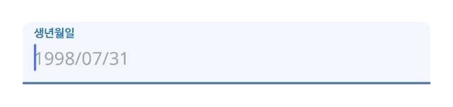

## 📜 어쩌다 보니 종이가 안 쓰이네요

오랜기간 클라이밍을 해왔고, 그러다보니 자연스럽게 다양한 클라이밍 짐을 다녔다. 그때마다 반복되는 일이 하나있었는데, 새로운 곳을 방문하게 될때마다 종이동의서를 반드시 작성해야 한다는 것이다.

처음에는 별생각 없이 계속 적어냈지만, 갈수록 불편함이 느껴졌다.

- 동의서 내용은 비슷한데, 매번 처음쓰는 것처럼 해야했다.
- 종이 서명이라 작성도 오래 걸리고, 사람이 몰리면 입장 대기 시간이 길어졌다.
- 동의서를 받는 직원은 해당 종이동의서를 보관하고, 필요시 해당 동의서를 하나하나 찾아야했다.

특히 지인이 클라이밍 센터를 운영하면서 이 문제를 직접 겪고 있는 걸 보니, **"이거 종이 대신 전자동의서로 해결할 수 있지 않을까?"** 하는 생각이 들었다. 처음엔 단순한 아이디어였지만, 결국 직접 개발을 시작했다.

## 1. 🏃🏻 프로젝트 시작

처음에는 단순히 태블릿에서 서명만 받으면 끝날 줄 알았다. 그런데 막상 작업을 시작하니 생각할 게 많았다.

- 서명을 어떻게, 그리고 어디에 저장할 것인가?
- 법적으로 유효한가?
- 동의서 양식을 어떻게 통일할까?

이러한 고민들을 해결해 나가기위해 하나하나 서치를 했다.

1. 서명하고 저장하기 위해서 [react-signature-canvas](https://github.com/agilgur5/react-signature-canvas) 라이브러리를 사용
2. 법적유효성을 확인하기 위해 각종 전자서명 플랫폼(모두싸인, 싸인오케이 등)을 참조
3. 클라이밍 경력자와 처음 이용하는 사용자를 구분지어 동의서 양식을 작성

## 2. ⏳ 개발을 하면서 마주한 문제와 해결 방법

개발을 해나가면서 가장 중요하게 생각했던 것은 사용자가 불편함을 느끼지 않으면서 자연스럽게 디지털 동의서를 작성할 수 있도록 만드는 것이었다.
단순히 종이 서명을 디지털 서명으로 바꾸는 것이 아니라, 동의서 작성 경험 자체를 개선하는 방향으로 개발을 나아갔다.

### 📝 QR코드 도입

처음에는 태블릿에서만 서명을 받도록 하려고 했지만, 실제 운영 테스트를 진행하면서 QR 코드 방식이 훨씬 더 편리하다는 걸 깨달았다.

🚨 **문제점**

- 태블릿이 한정되어 있어 사용자가 몰릴 경우 대기 시간이 발생
- 익숙하지 않은 기기로 입력 실수 사례 발생

✅ **해결방법**

- QR 코드를 활용한 모바일 서명 방식으로 변경
- 입구에 QR 코드를 배치하여 사용자가 자신의 스마트폰으로 바로 접속해 서명 가능하도록 개선

처음엔 태블릿 서명이 가장 직관적일 거라 생각했지만, 운영 테스트를 해보면서 사용자가 QR 코드 방식을 더 선호한다는 걸 알게 되었다.

---

### 📝 다국어 도입

전자동의서를 개발하고 실제 운영하면서, 외국인 방문객이 예상보다 많다는 걸 깨달았다. 일부는 브라우저 번역 기능을 사용했지만, 중요한 법적 내용을 정확하게 전달하기 어려웠다.

그래서 다국어를 도입하기로 했고, [next-intl](https://next-intl.dev) 라이브러리를 사용했다. 하지만, 이 프로젝트는 **패스 입력(사용자용)**과 **패스 관리(관리자용)** 두 개의 영역으로 나뉘어 있었다.

따라서 **사용자 페이지에서만 다국어가 필요했지만**, `next-intl`을 부분 적용하려다 보니 **라우터에서 경로 문제가 발생**했다.

🚨 **문제점**

- `localePrefix: "as-needed"` 설정을 하지 않으면, 모든 페이지에 `/[locale]`이 추가됨
- 관리자 페이지에는 다국어가 필요 없는데, 경로가 `en/admin`처럼 붙는 문제 발생

✅ **해결방법**

- `localePrefix: "as-needed"` 옵션을 추가하여, **사용자 페이지에서만 언어 경로가 적용되도록 설정**
- 관리자 페이지는 기본 언어(한국어)로 유지하고, URL 변경 없이 접근 가능하게 개선

처음 `next-intl`을 사용하다 보니 설정이 헷갈렸지만, 향후 관리자 시스템을 분리하면 더 깔끔하게 다룰 수 있을 것 같다.

---

### 📝 사용자 폼 개선

[react-hook-form](https://react-hook-form.com/)을 활용해 입력 폼을 구성했는데, 실제 테스트를 해보니 **생년월일 입력 방식이 일관되지 않았다.**

🚨 **문제점**

- `1988-10-10`, `1988/10/10`, `10/10/1988` 등 여러 형식으로 입력됨
- 데이터 정제 과정에서 불필요한 변환 로직이 필요함
- 날짜를 8자리(YYYYMMDD)로 입력하게 하면 실수를 줄일 수 있지만, UX가 나빠짐

✅ **해결방법**

- `react-number-format` 라이브러리를 활용하여 **"YYYY/MM/DD"** 형식으로 입력하도록 제한
- 자동으로 `/`가 입력되도록 설정하여 **사용자가 더 쉽게 입력할 수 있도록 개선**

```js
<Controller
  control={control}
  name="dateOfBirth"
  render={({ field }) => {
    const { ref, ...rest } = field;
    return <PatternFormat {...rest} customInput={TextInputBirth} format="####/##/##" mask={'_'} />;
  }}
/>
```

<center>
  
</center>

## 3. 🎁 도입 후 변화

### 🌲 동의서 작성 시간이 크게 줄었다.

- QR 코드로 바로 접속해서 모바일로 서명할 수 있다보니, 동의서를 주고 받는 시간이 크게 줄었다.

### 🌲 관리가 간편해졌다.

- 기존에 종이서류를 따로 보관하고 찾아야 했지만, 관리자 페이지에서 손쉽게 확인가능하다.
- 법적 문제가 생겼을때 출력해서, 동의서를 조회할 수 있다.

### 🌲 그리고, 종이가 필요없어졌다.

- 종이동의서를 사전에 비치할 필요가 없어졌고, 고로 종이 인쇄량이 확 줄었다.
- "어쩌다 보니 숲을 지켰다."

## 4. 🧐 앞으로의 고민

이제 동의서 작성을 디지털화하면서 여러 문제가 해결됐지만, 여전히 개선할 여지가 있다.
특히, 동의서를 **일정 기간 후 자동으로 폐기하는 기능**을 추가하고 싶다.

현재는 모든 동의서를 계속 보관하고 있지만,

- 법적으로 영구 보관이 필요한지 여부를 확인해야 하고,
- 오래된 동의서를 삭제하는 것이 개인정보 보호 측면에서도 더 안전할 것이다.

삭제 기능 자체는 이벤트 스케줄러를 활용하면 쉽게 구현할 수 있지만,
법률적 문제를 고려해 적절한 보관 기간과 삭제 방식을 먼저 검토해봐야 할것 같다.

이 프로젝트는 단순한 편의 기능을 넘어서,
클라이밍 짐 운영의 효율성을 높이고, 예상치 못한 환경 보호 효과까지 가져왔다.
어쩌다 보니, 정말 **숲을 지키고 있었던 셈이다.** 😆
앞으로도 더 나은 방향으로 개선해 나가야겠다.
