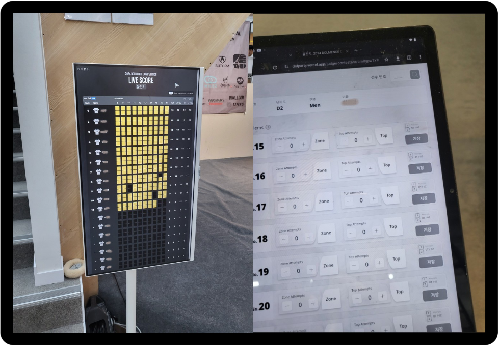
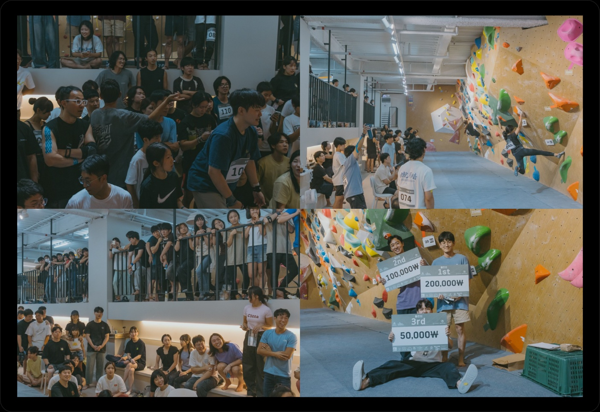
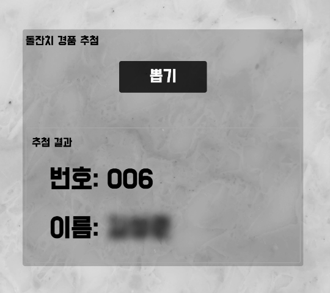

      

# 📞 클라이밍 대회 사이트 의뢰

지인이 운영 중인 클라이밍 센터에서 대회를 개최하려고 하는데, 관련 기능을 개발해줄 수 있는지 의뢰가 왔다. 8월 중순 이후에 받은 의뢰였지만, 9월 초까지 개발을 완료해야 해서 기간이 매우 촉박했다. 하지만 <b>"내가 직접 사이트를 만들고 대회를 운영해볼 수 있는 기회가 얼마나 있을까?"</b>라고 생각했고, 결국 개발에 착수하기로 했다.

## 1. 🏃🏻 프로젝트를 시작하며

총 개발 기간은 3주였고, 심지어 클라이밍 대회를 채첨하는 사이트는 나에게 매우 생소했다. 또 참고할 만한 레퍼런스가 많지도 않았다. 그래서 클라이밍 대회 영상과 유사한 사이트를 최대한 많이 찾아보고 참고했다.

다음은 내가 참고했던 사이트들이다.

- https://gym.vertical-life.info/scorecard
- https://ifsc.results.info/#/event/1291/cr/7669

본격적인 개발에 들어가기 전, Figma를 통해 전체적인 화면 구성과 방식을 계속 그려나갔다. 그 후 의뢰인에게 확인 작업을 진행했다. 짧은 개발 기간을 고려해, 수동으로 입력할 수 있는 부분은 최대한 기능에서 제외했다.

## 2. ⏳ 개발 과정

개발 과정에서 가장 중요한 부분은 <b>실시간 성적 채점</b>과 <b>라이브 스코어 조회</b> 기능이었다. 대회 참가자들이 푼 문제의 성적을 실시간으로 입력하고, 이를 통해 즉시 점수를 확인할 수 있어야 했기 때문이다. 처음에는 이 기능을 WebSocket을 통해 구현하고 싶었지만, 참가자들이 그렇게 자주 성적을 조회할 필요가 없다고 판단했다. 그래서 react-query의 `refetchInterval`을 사용하여 구현하기로 결정했다.

## 3. 🚨 마주한 문제와 해결 방법

내가 개발할 때 가장 큰 어려움을 겪었던 부분은 데이터베이스 설계와 순위를 조회할 수 있는 쿼리 구현이었다.

데이터베이스 설계 경험이 부족해서 초기 설계에 애를 먹었다. 그래서 처음에는 종이에 계속 그려가며 틀을 잡았다. 이 틀을 바탕으로 ERDCloud에 옮겨 그렸고, 이후 Prisma 스키마를 구성해 모델을 완성했다.

데이터베이스 구조는 완성했지만, 내가 만든 구조로 순위 조회가 제대로 될지 의문이 들었다. 그래서 사내 백엔드 개발자 한 분께 커피를 한 잔 사드리며 내 설계가 맞는지 확인을 요청했다. 확인 응답을 받은 후에는 자신감을 얻어 개발을 계속 진행해 나갔다.

## 4. 🎁 성과 및 결과

결국, 대회 시작 전까지 사이트를 성공적으로 런칭할 수 있었다. 예상보다 많은 124명의 참가자가 등록하면서, 내가 만든 사이트에 버그가 발생하지는 않을지 긴장감이 높아졌다. 이를 대비해, 대회에도 직접 참관하여 각 세션이 끝날 때마다 데이터를 주기적으로 백업했다.

대회 당일에는 실시간 성적 반영이 정확하게 이루어져 사이트 운영이 원활하게 진행되었다. 기존 클라이밍 대회에서는 수많은 채점지를 수동으로 처리하고, 경기 종료 후 결과를 취합하는 데 많은 시간이 소요되었다. 그러나 이번 대회에서는 이러한 문제가 크게 해소되었고, 심판과 참가자 모두 빠르고 효율적인 채점 시스템 덕분에 편리함을 느꼈다.

  <figure>
          
      <figcaption>대회 사진</figcaption>
  </figure>

대회가 마무리될 즈음, 경품 추첨 기능이 필요하다는 요청이 들어와 신속하게 해당 기능을 추가했다. 이를 위해 참가자 테이블에 `isSelected` 컬럼을 추가해, 이미 추첨된 참가자를 구분할 수 있도록 설계했다. 실제 운영 서버에는 적용하지 않고, 경품 추첨은 도커 서버에서 실행하여 기능을 처리했다.

  <figure>
          
      <figcaption>경품 추첨</figcaption>
  </figure>

## 5. 🧎🏻‍➡️ Next step!..

짧은 기간에 개발을 완료하려다 보니, 실제로 구현하고 싶었던 기능들을 많이 빠트린 것 같다. 이후 프로젝트를 개선할 기회가 생긴다면, 다음과 같은 기능들을 추가해봐야겠다.

- `대회 생성 및 대회 리스트 조회`: 사용자가 새로운 대회를 쉽게 생성하고, 대회 목록 조회 기능
- `참가자 정보 입력`: 참가자의 정보를 입력하고 관리할 수 있는 기능
- `WebSocket을 통한 실시간 조회`: WebSocket을 사용해 실시간 데이터를 제공하는 기능
- `개선된 디자인`: 사용자 경험을 더 개선할 수 있는 UI/UX로 구성
- `운영 중인 서비스 버그 대응 능력`: 서비스 운영 중 발생하는 버그에 신속하게 대응하고 문제를 해결하는 능력

이번 프로젝트는 기술적으로나 개인적으로 많은 성장을 이끌어낸 경험이었다. 문제 해결 과정에서 겪었던 다양한 도전들이 더욱 발전시키는 계기가 되었고, 앞으로 이러한 경험을 바탕으로, 더 나은 발전을 하기 위해 분발해야겠다. 🧐
