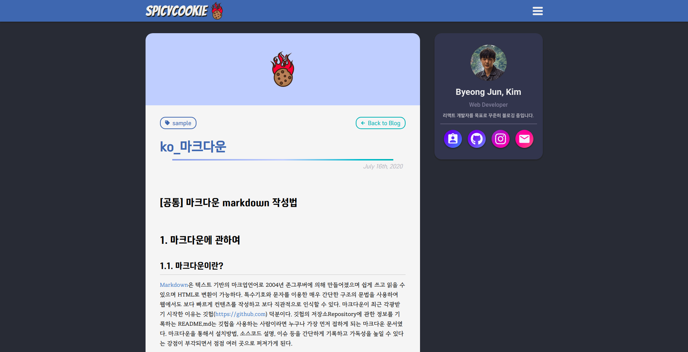

# 🍪 내 블로그 내가 직접 만들어 보자

Velog나 티스토리와 같은 여러 블로그들이 있지만, 다른 사람들은 블로그를 직접 만들고 운영하는걸 보고, 나만의 블로그를 만들어보고자 마음을 먹었다. 여러 가지 방법을 찾다가 `Gatsby`라는 프레임워크가 눈에 들어왔다. 특히, Gatsby는 <b>정적 사이트 생성(SSG)</b>에 강점이 있고, React를 기반으로 한다는 점에서 관심이 갔다. 그래서 첫 블로그 프로젝트를 Gatsby로 달려보았다. 🏃🏻

## 1. 프로젝트를 시작하며

처음에는 Gatsby의 공식 홈페이지에서 빠르게 튜토리얼을 따라해보았는데, 생각보다 간단했다. 이후 나만의 블로그를 만들 템플릿을 찾기 위해 [Gatsby 템플릿](https://www.gatsbyjs.com/starters/)사이트를 둘러보았지만, 마음에 드는 디자인이 없어서 빈 화면부터 시작하고자 [Hello World 템플릿](https://www.gatsbyjs.com/starters/gatsbyjs/gatsby-starter-hello-world/)으로 프로젝트를 시작했다. 이렇게 빈 화면에서 처음부터 만들어가는 과정이 오히려 나만의 멋진 스타일을 살리기에 적합하다 생각했다.

## 2. Markdown 파일을 이용한 콘텐츠 관리



내가 가장 원하는 블로그 글 작성 방식은 `Markdown`을 사용한 방법이었다. Markdown을 통해 글을 작성하면, 블로그 글을 다른 플랫폼으로 쉽게 가져갈 수 있어 유연함이 컸던게 가장 좋았다. 이전에 티스토리에서 블로그를 운영할 때의 글을 하나씩 옮기는 과정이 너무 번거로워서 포기하고 왔다. 이와 달리, Gatsby는 Markdown 파일을 기반으로 콘텐츠를 쉽게 관리하고 사이트에 반영할 수 있는 다양한 플러그인을 제공해서 훨씬 간편했다.

### 📝 블로그 글 작성 방법

```
---
title: 'Gatsby로 처음만든 블로그'
date: '2020-08-30'
category: 'Essay'
cover: './images/spicycookie.png'
private: false
---

# 글 내용 Markdown
```

위 블록 안의 메타데이터는 내가 자유롭게 설정할 수 있는데, 나는 `title`, `date`, `category`, `cover`, `private` 로 설정하였고, 원하는 방식으로 데이터를 가공하여 블로그 글을 나타낼 수 있다. 여기서 기존 템플릿에 글 비공개 기능을 추가하기 위해 `private`을 추가했다.

## 3. 스타일링

### 🎨 테마 변경기


블로그 디자인을 직접 해나가는 과정이 점점 신났다. <b>styled-components</b>를 사용해 블로그를 스타일링했고, `ThemeProvider`를 통해 다크 모드를 구현하려고 했다. 하지만, 욕심이 생겨 테마를 4가지나 만들어 버렸다🤦🏻... 테마마다 어울리는 색상을 찾는 과정은 생각보다 어려웠다. 잠깐이나마 디자이너에 대한 존경심이 생겼다. 어울리는 여러 색상을 찾기위해 [Color Hunt](https://colorhunt.co/) 를 참조했다. 다음에는 여러 테마를 무리하게 만들기 전에 백번은 더 고민해봐야겠다.

### 🍪 로고


블로그를 만들면서 가장 중요한 요소 중 하나가 로고였다. 개발에서 자주 사용되는 용어인 `쿠키`를 활용해 보고 싶었다. 여기서 그냥 쿠키를 사용하면 너무 밋밋하니 쿠키에 불을 질러봤다. 쿠키에 불이 활활 타니 아주 볼만했다. 그래서 불타는 매운 쿠키 `SpicyCookie`가 탄생되었다.

## 4. 배포 과정

개발이 어느 정도 마무리되고 나니, 블로그를 배포할 시간이 다가왔다. Gatsby는 정적 파일을 생성해주는 프레임워크이기 때문에, `Netlify`와 같은 호스팅 서비스와 궁합이 아주 좋았다. 빌드 후에 배포된 페이지는 정적 파일로 호스팅되기 때문에, 속도가 매우 빨랐다... 신세계였다.

```
gatsby build
```

이 명령어 하나로 프로젝트를 빌드하고 Netlify에 연동하면 곧바로 배포되었다. 그래서 글을 하나 추가 작성 하려면, 레포에 Push만 하면 돼서 글 쓰는거에 대한 부담이 없었다.

## 5. 느낀 점

나만의 블로그를 만들겠다고 생각했을 때는 쉬울 거라고 생각했지만, 실상은 익숙치않은 GraphQL로 데이터를 가져오고 페이지를 생성하는 과정에서 미숙함이 있었다. 또한 Markdown 기반 글 작성을 위해 사전에 설정해야 할 부분도 상당히 많았다.

그러나 시간이 지나면서 Gatsby의 확장 가능성과 유연함을 알게되었고 또한, 블로그 글이 즉시 웹에 반영되고 Gatsby의 빌드 속도와 성능 최적화를 체감하면서 정적 사이트의 장점을 몸소 느낄 수 있었다. 첫 블로그를 만드는데에 있어 많은 시행착오를 겪었지만, 그만큼 배우는 것도 많았다.

나만의 블로그가 생겼으니 앞으로 많은 글들을 작성해 나가야겠다.
