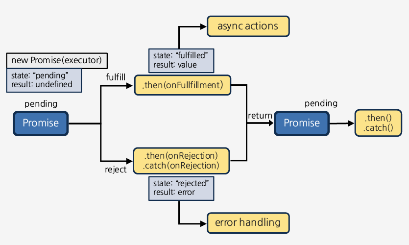

# Promise란 무엇인가?

`Promise`는 자바스크립트에서 제공하는 비동기를 간편하게 처리할 수 있게 도와주는 객체이다. Promise 이전에 비동기 처리로 콜백 패턴을 주로 사용했었다. 그러나 `콜백 지옥(Callback Hell)`으로 인해 가독성도 나쁘고, 비동기 처리 중에 발생한 에러의 처리가 까다로웠다. Promise는 이러한 단점을 보완하기 위해 나온 대안이라고 봐도 무방하다. 

## 끔찍한 Callback에서 벗어나 Promise 적용하기

Promise를 설명하기에 앞서, Callback과 Promise를 통해 짜진 두 코드를 보자.

```
/* callback */
function add10(a, callback){
   setTimeout(() => callback(a + 10), 100);
}

add10(5, res => {
   console.log(res); // 15
});
```
```
/* promise */
function add20(a){
   return new Promise(resolve => setTimeout(() => resolve(a + 20), 100));
}

add20(5)
   .then(console.log); // 25
```

가장 명확하게 보이는 차이는 Promise가 Callback과 달리 `결과를 값으로 받아서 저장`할 수 있다는 것이다. 
즉, Promise는 결과 그 자체를 값으로 받기 때문에 연속으로 실행하는 코드에선 (`then()` 이용) Callback보다 더 가독성 있는 코드가 된다.

```
/* callback */
add10(5, res => {
   add10(res, res => {
      add10(res, res => {
         console.log(res); //35
      }); // Callback Hell...
   });
});
```
```
/* promise */
add20(5)
   .then(add20)
   .then(add20)
   .then(console.log); //65
```

# 어떻게 사용할까?

## Promise의 상태
가장 먼저, Promise는 대표적으로 다음과 같은 3가지 상태를 가진다.

- Pending(대기): 비동기 처리 로직이 아직 미완료인 상태
- Fulfilled(이행): 비동기 처리가 완료되어 promise가 결과 값을 반환해준 상태
- Rejected(실패): 비동기 처리가 실패하거나 오류가 발생한 상태


### Pending 상태

아래와 같이 Promise를 호출하면 Pending 상태가 된다. 이때 콜백 함수의 인자로 resolve, reject에 접근할 수 있다.
```
new Promise(function(resolve, reject){
    // ...
});
```

### Fulfilled 상태

콜백 함수의 인자 `resolve`를 실행하면 Fulfilled 상태가 된다.
```
new Promise(function (resolve, reject) {
   resolve();
});
```
이후 이행 상태가 되면 `then()`을 이용해 처리 결과 값을 받을 수 있다.


### Rejected 상태

콜백 함수의 인자 `reject`를 실행하면 Rejected 상태가 된다.

```
new Promise(function(resolve, reject) {
  reject();
});
```
이후 실패 상태가 되면 `catch()`를 이용해 error를 다룰 수 있다.

프로미스 처리 흐름을 그림으로보면 다음과 같다.

<center></center>


정해진 기능을 수행하고 나서 정상적 성공 예상치못한 문제 발생 에러를 전달해준다.

비동기 작업을 하는 함수의 리턴타입으로 쓰이는게 바로 프로미스
뭔가 함수가 비동기적인 작업을 한다 그 함수는 프로미스를 반환한다.

대표적 예시 fecth API
네트워크 요청을 날리기 위한 API
요청을 보내고 응답을 받는 과정에는 불가피하게 딜레이가 발생할 수 밖에 없다.

fetch함수 역시 프로미스 객체를 반환

비동기 처리를 위해 콜백 패턴을 사용할때는 처리 순서를 보장하기 위해 여러 개의 함수가 중첩되어 복잡도가 높아지는 콜백 지옥(Callback Hell)이 발생하는 단점이 있었다. 이는 가독성이 너무 나쁘게

성공했을때 부를 함수, 실패했을때 부를 함수,두가지를 가지고 있는 객체가 프로미스

콜백 함수를 미리 받았어야 했는데 이제는 프로미스를 반환하면 끝남

원래 필요하던 매개변수가 사라져서 간결해짐

```
let p = new Promise((resolve, reject) => {
    let a = 1 + 1; // 약속하는이
})

```

Promise의 3가지 상태