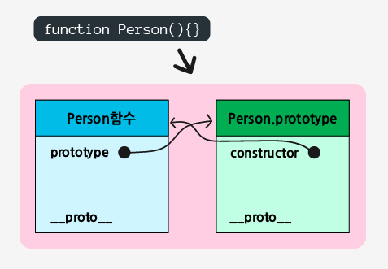
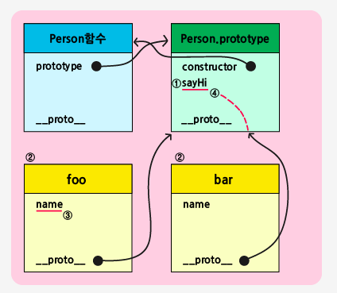
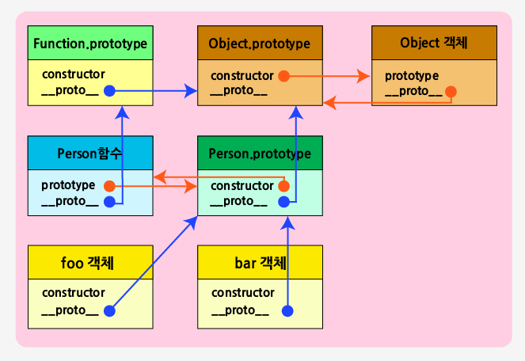

# 🍪 자바스크립트에서 ProtoType의 개념

자바스크립트에는 클래스라는 개념이 따로 없어서, 기존의 객체를 복사해서 새로운 객체를 생성한 후 기존 객체와 생성된 새로운 객체를 서로 연결한다. ECMA6 표준(ES6)에서 `Class 문법` 이 추가되었지만, 이 역시 내부적으로 프로토타입 기반으로 연결되어 있다.

그렇다면 어떤 식으로 연결되어 있을까??

## `prototype 프로퍼티` 와 `__proto__`

가장 먼저 `prototype 프로퍼티`에 대해서 알아보자.

다음과 같이 함수를 정의했다고 보자.

```
function Person(){}
```

함수를 정의했을 때, 함수만 생성되는 것이 아니라 해당 함수의 prototype 객체도 같이 생성된다. 이 둘을 서로 상호참조 되게 해주는 내부적으로 수행되는 작업도 있다.

정의한 `Person 함수`는 멤버 prototype 프로퍼티를 통해 Person.prototype 객체를 참조하고, `Peroson.prototype 객체`는 멤버 constructor를 통해 Person 함수를 참조한다.

> 객체 리터럴을 사용해 객체를 생성했을 경우, 그 객체의 Prototype 객체는 Object.prototype이다.

<center></center>

```
console.log(Person.prototype.constructor === Person) // true
```

위 그림에서 Person.prototype 객체가 가지고있는 `constructor`은 생성된 함수를 가리키는 것을 볼 수 있다.

정리하자면, prototype의 객체는 함수를 정의했을 때 생성되며, 이는 정의했던 함수의 멤버인 `prototype 프로퍼티`를 통해 접근이 가능하다.

### 그렇다면 `__proto__`는 무엇일까??

`__proto__`는 정확히는 크롬브라우저에서 사용하는 프로퍼티명이며, ECMA 명세서에는 `[[Prototype]]`이라는 이름을 사용한다. (이하 `__proto__`)

가장 먼저 위에서 생성했던 Person 생성자 함수를 통해 이어서 알아보자.

```
// Person 생성자 함수 선언
function Person(name){
    this.name = name
}

// ① Person.prototype 객체에 함수 정의
Person.prototype.sayHi = function(){
    console.log('Hi! My name is ' + this.name);
}

// ② 인스턴스 객체 생성
var foo = new Person('Bob');
var bar = new Person('Jun');

// ③
console.log(foo.name);

// ④
bar.sayHi();
```

<center></center>

코드와 그림을 함께보면 `__proto__`의 역할을 잘 알 수 있다.

1. 가장 먼저 Person.prototype에 함수를 정의(①)하고, 2개의 객체를 생성(②)했다. 이때 생성된 2개의 객체는 부모의 property 객체를 참조한다.
2. 그 후 생성된 객체 중 foo에서 name에 접근(③)하려고 하면, 가장 먼저, 해당 객체(foo)에 name이 있는지를 체크하고, 만약에 없으면 `__proto__`를 통해 부모 객체에서 찾는다.
3. 이어서 객체 bar에서 sayHi 함수에 접근(④)하려고 하면, 해당 객체(bar)에서 있는지를 체크 한 후 없으니 `__proto__`를 통해 부모 객체가 접근하려는 함수가 있는지를 체크한다.

이처럼 `__proto__`는 부모의 Prototype에 대한 정보를 가지고 있으며, 모든 객체는 `__proto__`을 갖고있다. 즉, 객체 원형인 프로토타입을 이용해서 새로운 객체를 만들어내는데, 이것을 통해 이렇게 생성된 객체 역시 또 다른 객체의 원형이 될 수도 있다.

위에서 바로 했던 과정들이 `프로토타입 체인`이다.

## 프로토타입 체인

정리하자면, 프로토타입 체인은 객체의 Property에 접근 시, 해당 객체에 Property가 없을 경우 부모 객체의 Property를 참조하는 과정이다. 위에서 생성했었던 Person 함수 역시 `__proto__`를 가지고 있는 것을 볼 수 있는데, 이를 쭉 타고가면 Object.prototype이 나온다.

즉, 프로토타입 체인의 종점(End of prototype chain)은 `Object.prototype`이다.

<center></center>

그렇다면 어떻게 Object.prototype과 Person.prototype이 연결 될 수 있었을까?

내부적으로 `__proto__`는 다음과 같은 동작을 한다.

```
var foo = new Person();
```

위 과정을 아래처럼 유사하게 동작한다.

```
var foo = new Object();
foo.[[Prototype]] = Person.prototype;
Person.call(foo);
```

## 🔍 Reference

- [프로토타입(Prototype) 객체](https://poiemaweb.com/js-prototype)
- [Poiemaweb Prototype](https://victorydntmd.tistory.com/52)
- [생활코딩](https://opentutorials.org/module/4047/24629)
