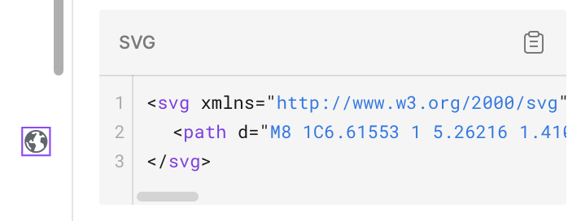
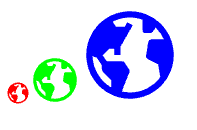

# Next.js에서 SVG 사용하기

`Next Image` 태그를 사용해 svg를 선언하는 것보다, 유연하게 스타일링 하기 위해서 `컴포넌트화` 시켜서 사용하는 것이 대다수가 사용하는 방법 같습니다.

## 방법 1. SVGR

- 가장 많이 사용되는 방식

### 설치 및 설정

[Next.js - SVGR](https://react-svgr.com/docs/next/)

```bash
npm install -D @svgr/webpack
```

```jsx
/** @type {import('next').NextConfig} */
const nextConfig = {
  // ADDED
  webpack(config) {
    config.module.rules.push({
      test: /\.svg$/,
      use: ['@svgr/webpack'],
    });

    return config;
  },
};

export default nextConfig;
```

### 구현

컴포넌트화 시킨 것이라, `public` 하위가 아닌 `src` 폴더 내에 선언하여야 합니다.

```jsx
├── public (x)
├── src
│   ├── app
│   └── assets - (o)
```

호출을 간편하게 위해 아래와 같이 모듈화 시키는게 좋아보입니다.

```tsx
// example)
import AppleIcon from './apple.svg';
import BananaIcon from './banana.svg';

export { AppleIcon, BananaIcon };
```

### 적용 예시

1. `Figma`와 같은 디자인툴에서 SVG 코드 추출

<center></center>

1. 색상이나 너비, 높이를 가변적으로 입력받기 위해서 SVG 코드 가공
   (지정되어있는 값이 있다면 `current`로 대체)

```tsx
// before
<svg xmlns="http://www.w3.org/2000/svg" width="~~16~~" height="~~16~~" viewBox="0 0 16 16" fill="none">
  <path d="M8 1C6.61553 1 5.26216 1.41054 4.11101 2.17971C2.95987 2.94888 2.06266 4.04213 1.53285 5.32122C1.00303 6.6003 0.86441 8.00776 1.13451 9.36563C1.4046 10.7235 2.07129 11.9708 3.05026 12.9497C4.02922 13.9287 5.2765 14.5954 6.63437 14.8655C7.99224 15.1356 9.3997 14.997 10.6788 14.4672C11.9579 13.9373 13.0511 13.0401 13.8203 11.889C14.5895 10.7378 15 9.38447 15 8C14.9979 6.14413 14.2597 4.36486 12.9474 3.05256C11.6351 1.74026 9.85588 1.00209 8 1ZM2.01 8.197L2.6792 8.4199L3.5 9.65135V10.2929C3.50001 10.4255 3.55268 10.5527 3.64645 10.6465L5 12V13.1882C4.11899 12.6784 3.38225 11.9527 2.85915 11.0795C2.33606 10.2063 2.04384 9.21433 2.01 8.197ZM8 14C7.56749 13.9992 7.13633 13.9514 6.7141 13.8576L7 13L7.9023 10.7442C7.93243 10.6689 7.94378 10.5874 7.93538 10.5067C7.92699 10.4261 7.89909 10.3486 7.8541 10.2811L7.14845 9.22265C7.10279 9.15416 7.04093 9.098 6.96835 9.05916C6.89577 9.02032 6.81472 9 6.7324 9H4.2674L3.6433 8.0637L4.70705 7H5.5V8H6.5V6.6328L8.4341 3.24805L7.5659 2.75195L7.13845 3.5H5.7676L5.2246 2.68555C5.95356 2.30084 6.75472 2.0723 7.57694 2.01452C8.39917 1.95675 9.22441 2.071 10 2.35V4C10 4.13261 10.0527 4.25979 10.1464 4.35355C10.2402 4.44732 10.3674 4.5 10.5 4.5H11.2324C11.3147 4.5 11.3958 4.47968 11.4683 4.44084C11.5409 4.402 11.6028 4.34584 11.6485 4.27735L12.0869 3.61965C12.6581 4.15221 13.1201 4.79087 13.4473 5.5H11.41C11.2944 5.5 11.1824 5.54005 11.093 5.61333C11.0036 5.68661 10.9424 5.7886 10.9197 5.90195L10.5587 8.13735C10.5417 8.24249 10.5587 8.3503 10.6073 8.44509C10.6558 8.53987 10.7334 8.61667 10.8287 8.6643L12.5 9.5L12.8426 11.5279C12.2876 12.2927 11.5596 12.9154 10.7179 13.3451C9.87631 13.7747 8.94496 13.9991 8 14Z" fill="~~#60666D~~"/>
</svg>

// after (16 -> current, #60666D -> current)
<svg xmlns="http://www.w3.org/2000/svg" width="current" height="current" viewBox="0 0 16 16" fill="none">
  <path d="M8 1C6.61553 1 5.26216 1.41054 4.11101 2.17971C2.95987 2.94888 2.06266 4.04213 1.53285 5.32122C1.00303 6.6003 0.86441 8.00776 1.13451 9.36563C1.4046 10.7235 2.07129 11.9708 3.05026 12.9497C4.02922 13.9287 5.2765 14.5954 6.63437 14.8655C7.99224 15.1356 9.3997 14.997 10.6788 14.4672C11.9579 13.9373 13.0511 13.0401 13.8203 11.889C14.5895 10.7378 15 9.38447 15 8C14.9979 6.14413 14.2597 4.36486 12.9474 3.05256C11.6351 1.74026 9.85588 1.00209 8 1ZM2.01 8.197L2.6792 8.4199L3.5 9.65135V10.2929C3.50001 10.4255 3.55268 10.5527 3.64645 10.6465L5 12V13.1882C4.11899 12.6784 3.38225 11.9527 2.85915 11.0795C2.33606 10.2063 2.04384 9.21433 2.01 8.197ZM8 14C7.56749 13.9992 7.13633 13.9514 6.7141 13.8576L7 13L7.9023 10.7442C7.93243 10.6689 7.94378 10.5874 7.93538 10.5067C7.92699 10.4261 7.89909 10.3486 7.8541 10.2811L7.14845 9.22265C7.10279 9.15416 7.04093 9.098 6.96835 9.05916C6.89577 9.02032 6.81472 9 6.7324 9H4.2674L3.6433 8.0637L4.70705 7H5.5V8H6.5V6.6328L8.4341 3.24805L7.5659 2.75195L7.13845 3.5H5.7676L5.2246 2.68555C5.95356 2.30084 6.75472 2.0723 7.57694 2.01452C8.39917 1.95675 9.22441 2.071 10 2.35V4C10 4.13261 10.0527 4.25979 10.1464 4.35355C10.2402 4.44732 10.3674 4.5 10.5 4.5H11.2324C11.3147 4.5 11.3958 4.47968 11.4683 4.44084C11.5409 4.402 11.6028 4.34584 11.6485 4.27735L12.0869 3.61965C12.6581 4.15221 13.1201 4.79087 13.4473 5.5H11.41C11.2944 5.5 11.1824 5.54005 11.093 5.61333C11.0036 5.68661 10.9424 5.7886 10.9197 5.90195L10.5587 8.13735C10.5417 8.24249 10.5587 8.3503 10.6073 8.44509C10.6558 8.53987 10.7334 8.61667 10.8287 8.6643L12.5 9.5L12.8426 11.5279C12.2876 12.2927 11.5596 12.9154 10.7179 13.3451C9.87631 13.7747 8.94496 13.9991 8 14Z" fill="current"/>
</svg>
```

1. 모듈화

```
import EarthIcon from './earth.svg';
export { EarthIcon };
```

1. 컴포넌트 호출

```tsx
import { EarthIcon } from '@/assets';

export default function Home() {
  return (
    <div>
      <EarthIcon fill="#ff0000" width="24" height="24" />
      <EarthIcon fill="#00ff00" width="50" height="50" />
      <EarthIcon fill="#0000ff" width="100" height="100" />
    </div>
  );
}
```

<center></center>

### 비고

[[Next JS / React] SVG 사용법(svgr이 최선일까요?)](https://www.timegambit.com/blog/solve/svg-usage-fix-bug)

## 방법 2. Tailwind와 함께 사용하기

- Icon을 컴포넌트로 선언 후 `props`를 받는 형태로 수정해 className에 색상 및 너비, 높이 지정이 가능
- tailwind.config에 디자인 색상을 지정해 전부 놓은 경우에 유용
  ```tsx
  theme: {
  		...
  			colors: {
  				darkBlue: '#2F4861',
  				lightBlue: '#afc5db',
  				extraDarkBlue: '#2B4075',
  				extraLightBlue: '#dbe1f0',
  			},
  	...
  }
  ```

### 적용 예시

적용하는 방법은 위에서 `SVGR`에서 했던 것과 같으며, 대신 `props`를 받는 컴포넌트를 추가합니다.

```tsx
import type { SVGProps } from 'react';

export default function EarthIcon(props: SVGProps<SVGSVGElement>) {
  return (
    <svg
      xmlns="http://www.w3.org/2000/svg"
      width="current"
      height="current"
      viewBox="0 0 16 16"
      fill="none"
      {...props}
    >
      <path
        d="M8 1C6.61553 1 5.26216 1.41054 4.11101 2.17971C2.95987 2.94888 2.06266 4.04213 1.53285 5.32122C1.00303 6.6003 0.86441 8.00776 1.13451 9.36563C1.4046 10.7235 2.07129 11.9708 3.05026 12.9497C4.02922 13.9287 5.2765 14.5954 6.63437 14.8655C7.99224 15.1356 9.3997 14.997 10.6788 14.4672C11.9579 13.9373 13.0511 13.0401 13.8203 11.889C14.5895 10.7378 15 9.38447 15 8C14.9979 6.14413 14.2597 4.36486 12.9474 3.05256C11.6351 1.74026 9.85588 1.00209 8 1ZM2.01 8.197L2.6792 8.4199L3.5 9.65135V10.2929C3.50001 10.4255 3.55268 10.5527 3.64645 10.6465L5 12V13.1882C4.11899 12.6784 3.38225 11.9527 2.85915 11.0795C2.33606 10.2063 2.04384 9.21433 2.01 8.197ZM8 14C7.56749 13.9992 7.13633 13.9514 6.7141 13.8576L7 13L7.9023 10.7442C7.93243 10.6689 7.94378 10.5874 7.93538 10.5067C7.92699 10.4261 7.89909 10.3486 7.8541 10.2811L7.14845 9.22265C7.10279 9.15416 7.04093 9.098 6.96835 9.05916C6.89577 9.02032 6.81472 9 6.7324 9H4.2674L3.6433 8.0637L4.70705 7H5.5V8H6.5V6.6328L8.4341 3.24805L7.5659 2.75195L7.13845 3.5H5.7676L5.2246 2.68555C5.95356 2.30084 6.75472 2.0723 7.57694 2.01452C8.39917 1.95675 9.22441 2.071 10 2.35V4C10 4.13261 10.0527 4.25979 10.1464 4.35355C10.2402 4.44732 10.3674 4.5 10.5 4.5H11.2324C11.3147 4.5 11.3958 4.47968 11.4683 4.44084C11.5409 4.402 11.6028 4.34584 11.6485 4.27735L12.0869 3.61965C12.6581 4.15221 13.1201 4.79087 13.4473 5.5H11.41C11.2944 5.5 11.1824 5.54005 11.093 5.61333C11.0036 5.68661 10.9424 5.7886 10.9197 5.90195L10.5587 8.13735C10.5417 8.24249 10.5587 8.3503 10.6073 8.44509C10.6558 8.53987 10.7334 8.61667 10.8287 8.6643L12.5 9.5L12.8426 11.5279C12.2876 12.2927 11.5596 12.9154 10.7179 13.3451C9.87631 13.7747 8.94496 13.9991 8 14Z"
        fill="current"
      />
    </svg>
  );
}
```

```tsx
import { EarthIcon } from '@/assets';

export default function Home() {
  return (
    <div>
      <EarthIcon className="fill-red-500 w-5 h-5" />
      <EarthIcon className="fill-green-500 w-20 h-20" />
      <EarthIcon className="fill-blue-500 w-40 h-40" />
    </div>
  );
}
```
