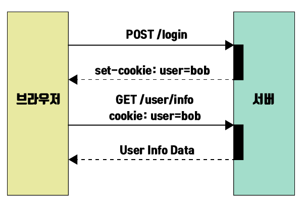

# 🍪 쿠키와 세션을 왜 사용할까?

클라이언트와 서버가 통신을 할때는, 서버가 클라이언트의 인증을 계속 해야햐는데, HTTP 프로토콜의 특징인 Stateless 때문에 클라이언트의 상태 정보를 알 수 없어 인증 정보가 유지되지 않는다.
이러한 상태를 유지하기 위해서 쿠키와 세션이라는 방법이 존재한다.

> Stateless(무상태): 요청 간 각각의 통신 파트너에 대한 상태를 보관하지않는다.

# 🍪 쿠키 (Cookie)

쿠키는 `키와 값(key, value)`형태로 구성되어있다. 어떤 웹 사이트에 들어갔을 때, 서버가 사용자 웹 브라우저에 전송하는 작은 데이터로, 브라우저는 쿠키를 저장해 놓았다가, 동일한 서버에 재 요청시 데이터를 함께 전송한다.
즉, 해당 도메인에 대한 쿠키가 존재하면, 웹 브라우저는 도메인에게 http 요청 시 쿠키를 함께 전달한다.

## 쿠키가 주로 사용되는 곳

- 로그인
- 장바구니
- 사용자 선호 테마
- 사용자 트래킹 정보

## 서버에서 클라이언트로 쿠키 전송 방법

쿠키는 서버에서 HTTP 응답 헤더에 Set-Cookie 속성을 통하여 클라이언트에게 제공할 수 있다.

### 쿠키 전송 방식 예시(ex. 로그인 정보 확인)

<center></center>

1. 클라이언트가 서버에 로그인 요청
2. 서버는 요청 데이터의 유효성 확인 후, 응답헤더에 쿠키를 담아 응답
3. 클라이언트는 서버에서 받은 쿠키를 자동으로 요청헤더에 추가해 유저 정보를 요청
4. 서버는 쿠키를 확인 한 후, 유저 정보를 응답

## 쿠키 옵션

### 📖 Domain

클라이언트에서 Domain에 설정된 도메인값과 서버의 도메인이 일치해야만 쿠키를 전송할 수 있다.

### 📖 Path

서버가 라우팅할 때 사용하는 경로로, Path 값을 만족하는 모든 경로는 쿠키를 전송할 수 있다.
기본값은 `/`이며, 만약 Path값이 `/user`로 설정되어 있고, 요청하는 URL이 `http://localhost.com:3000/user/login` 이여도 쿠키를 전송이 가능하다.

> Path 값은 `http://localhost:3000/user` 가 있으면 /user를 뜻한다.

### 📖 MaxAge / Expires

쿠키의 유효기간을 정하는 옵션이다. 유효기간이 지나면 쿠키는 자동으로 파괴된다.

- MaxAge: 앞으로 몇 초 동안 쿠키가 유효한지 설정
- Expires: 클라이언트를 기준으로 언제까지 유효한지 Date값으로 나타냄

### 📖 Secure

쿠키를 전송해야 할 때, 사용하는 프로토콜에 따른 쿠키전송 여부를 결정한다.
만약 해당 옵션이 `true` 라면, `HTTPS` 프로토콜을 이용하는 경우에만 쿠키를 전송할 수 있다.

### 📖 HttpOnly

자바스크립트에서 브라우저의 쿠키에 접근 여부를 결정한다.
만약 해당 옵션이 `true` 라면, 자바스크립트에선 쿠키에 접근이 불가능하다.
명시되어 있지 않을 경우, 기본값으로 `false`로 지정되어있다. 이 경우 XSS 공격에 취약하다.

```
<script>alert(document.cookie)</script>
```

> HttpOnly옵션을 true로 설정해 document.cookie를 이용해 쿠키에 접속하는 것을 막아 XSS 공격을 사전에 방지 할 수 있다.

### 📖 SameSite

Cross-Origin(CORS) 요청을 받은 경우 요청에서 사용한 메소드와 해당 옵션의 조합으로 서버의 쿠키 전송 여부를 결정하게 된다.
이를 설정하지 않으면, 해커가 다른 웹사이트를 통해서 데이터를 조작하려는 CSRF 공격을 막을 수 있다.

- Lax :Cross-Origin 요청이면 `GET` 메소드에 대해서만 쿠키를 전송
- Strict : Cross-Origin이 아닌 same-site 인 경우에만 쿠키를 전송
- None: 항상 쿠키를 보내줄 수 있고, 다만 쿠키 옵션 중 Secure 옵션이 필요함

> CSRF: 다른 오리진에서 유저가 보내는 요청을 조작하는 것

# 🍪 세션 (Session)

세션은 유저의 인증정보를 브라우저에서 저장하는 대신 서버측에서 관리한다. 이때 서버는 클라이언트를 구분하기 위해 암호화된 세션ID를 부여하며 브라우저가 종료할 때 까지
인증상태를 유지해준다.

- 세션ID는 브라우저 단위로 저장되고 브라우저 종료 시 소멸 됨
- 로그아웃 후, 다시 로그인해도 별도 사용자로 인식해 새로운 세션이 생성 됨

## 세션 vs 쿠키

세션 역시 브라우저에 세션ID를 저장하기 위해 쿠키를 사용하지만, 유저의 인증정보를 쿠키에 저장하는 쿠키방식에 비해 보안에 좋다. 하지만, 사용자가 많아질수록 서버 메모리를 많이 차지하기 때문에 성능 저하의 요인이 될 수도 있다.
