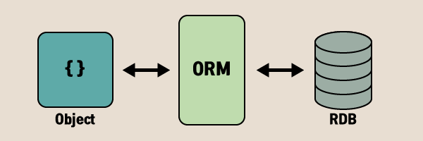
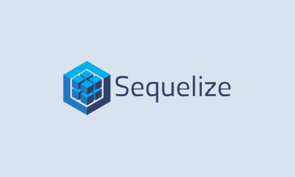

<center></center>

# 🍪 ORM

가장 먼저 ORM에 대해서 알아보자.

ORM(Object-Relational Mapping)은 데이터베이스와 데이터베이스 안의 테이블을 프로그래밍 할 때와 같이 객체처럼 쓸 수 있게 해주는 방식이다. 즉 이를 이용하면 직접 쿼리문을 날리지 않고, 객체의 형태로 데이터베이스에 접근해 객체를 삽입, 수정 등이 가능해진다. 대부분 개발 언어 플랫폼마다 제공되고 있으며, 대표적으로 spring에는 JPA, node.js에는 sequelize, 그리고 Django의 내장된 ORM이 있다.

## ORM의 장단점

### 장점

- 객체지향적인 코드로 더 직관적이고 비즈니스 로직에 더 집중할 수 있다.
- DBMS에 대한 종속성이 줄어든다.
- 재사용 및 유지보수의 편리성이 증가한다.
- 데이터베이스 마이그레이션을 쉽게 할 수 있다.

### 단점

- 모든 것을 ORM을 통해서만 구현하는 것은 힘들다.
- 프로시저가 많은 시스템에선 ORM의 객체 지향적인 장점을 활용하기 어렵다.
- 잘못 구현된 경우에 속도 저하 및 심각할 경우 일관성이 무너지는 문제점이 생길 수 있다.
- Raw Query보다 성능이 떨어진다.

# 🍪 Sequelize

<center></center>

Sequelize는 기본적으로 프로미스 기반(promise-based)으로된 Node.js ORM 이다. 지원하는 RDBMS들은 다음과 같이 있다.

지원하는 RDBMS

- Postgres
- MySQL
- MariaDB
- SQLite
- Microsoft SQL Server.

Sequelize는 자바스크립트 구문을 알아서 SQL로 변환해준다. 어느 정도 문법이 호환되므로 동일한 ORM 코드를 사용하면서, 다른 RDBMS로의 전환을 비교적 자유롭게 할 수 있다..

# 🍪 Sequelize 실습

[공식 문서](https://sequelize.org/master/index.html)를 바탕으로 Sequelize를 실습해보자.

## 프로젝트 초기 세팅

프로젝트를 시작하고자 하는 디렉터리에서 node를 initialize 하자.

```
$ npm init -y
```

기본적인 환경은 express를 통해 진행할 것이므로 `express`와 `body-parser`, `morgan`을 설치해주자.

- body-parser(request data의 body로부터 파라미터를 편리하게 추출가능)
- morgan(HTTP request logger middleware)

```
$ yarn add express body-parser morgan
```

app.js 파일을 만들어 기본적인 express를 구성해주자.

```
/* app.js */
const express = require("express");
const bodyParser = require("body-parser");
const morgan = require("morgan");

const app = express();
const PORT = 5000;

app.use(bodyParser.json());
app.use(bodyParser.urlencoded({ extended: false }));
app.use(morgan("tiny"));

app.get("/", (req, res) => {
  res.status(200).send("Test");
});

app.set("PORT", PORT);
app.listen(5000, () => {
  console.log(`listening on ${app.settings.PORT}`);
});
```

## Sequelize 시작하기

sequelize와 sequelize에서 선택하고자 하는 데이터베이스 엔진을 수동으로 설치해준다. mysql를 통해 실습할 것이기 때문에 이에 맞게 설치해주자.

```
$ yarn add sequelize mysql2
```

### Sequelize에서 선택할 수 있는 RDBMS

<pre>
<code>
$ yarn add pg pg-hstore // Postgres
$ yarn add mysql2 // MySQL
$ yarn add mariadb // MariaDB
$ yarn add sqlite3 // SQLite
$ yarn add tedious // MS SQL Server
</code>
</pre>

## Sequelize CLI를 설치해 마이그레이션 준비하기

Sequelize의 마이그레이션을 활용하면 Git과 같은 버전제어가 가능해진다. 이를 이용하기 위해 `sequelize-cli`를 설치해주자.

```
$ yarn add global sequelize-cli
```

## 프로젝트 Bootstrapping

프로젝트를 초기화하기위해 init 명령어를 입력해주어야 하는데, 그 전에 프로젝트 최상위에 `.sequelizerc`를 추가해 sequelize config를 만들어 생성되는 디렉터리, 파일 구조를 미리 변경해주자.

```
/* .sequelizerc */
const path = require('path');

module.exports = {
    'config': path.resolve('src/db/config/config.json'),
    'models-path': path.resolve('src/db/models'),
    'seeders-path': path.resolve('src/db/seeders'),
    'migrations-path': path.resolve('src/db/migrations')
}
```

```
$ npx sequelize init
```

위 명령을 실행했다면 다음과 같은 디렉터리들이 생성된다.

- config: DB서버와의 연결설정을 기술하고, 그 설정을 cli에 알려준다.
- models: 테이블의 스키마를 정의해주는 곳으로 cli가 이 파일을 참조하여 마이그레이션 파일을 생성한다.
- migrations: 실제로 cli가 DB서버에 테이블을 만들게 한다.
- seeders: 실제 데이터들을 넣으며, cli가 이를 보고 DB의 테이블에 데이터를 넣는다.

현재까지 프로젝트 구조를 보면 다음과 같다.

<pre>
<code>
.
├── node_modules
└── src
    ├── db
    │   ├── config
    │   │   └── config.json
    │   ├── migrations
    │   ├── models
    │   │   └── index.js
    │   └── seeders
    └── index.js
├── .sequelizerc
├── app.js
├── package.json
├── yarn.lock
├── yarn-error.log
</code>
</pre>

### ① config 설정

해당 파일은 DB서버와의 연결설정을 기술하는 곳이라고 했었다. `config.json`파일을 보면 다음과 같이 있다.

```
/* config.json */
{
  "development": {
    "username": "root",
    "password": null,
    "database": "database_development",
    "host": "127.0.0.1",
    "dialect": "mysql"
  },
  "test": {
    "username": "root",
    "password": null,
    "database": "database_test",
    "host": "127.0.0.1",
    "dialect": "mysql"
  },
  "production": {
    "username": "root",
    "password": null,
    "database": "database_production",
    "host": "127.0.0.1",
    "dialect": "mysql"
  }
}
```

development, test, production 이렇게 총 3가지 모드를 가지며, 기본적으로 development을 사용한다(models/index.js에 명시). 이 환경변수를 변경하기 위해선
다음과 같이 할 수 있다.

```
$ export NODE_ENV=development
$ export NODE_ENV=test
$ export NODE_ENV=production
```

`username`과 `password`에는 mysql 계정을 입력해주고, database에는 사용하고자 하는 Database를 작성해준다.

또한 sequelize-cli는 default로 mysql을 다루며, 다른 RDBMS를 다룬다면 `dialect`값을 변경 해주어야한다.

### ② DB 생성

생성한 데이터베이스가 없다면 config 설정에 따른 데이터베이스를 생성해주면 된다.

```
$ npx sequelize db:create
~~~
Database mydb created.
```

### ③ 모델 생성

여기까지 했다면, 이제 첫번째 마이그레이션을 만들 준비가 된 것이다. `model:generate`를 통해 모델을 생성해주자. 여기서 만약 모델을 잘못 생성했을 경우, 생성된 파일을 직접 수정하거나 삭제 후 명령을 다시 실행할 수 있다.

(OPTION: name: 모델 명, attributes: 모델 속성)

```
$ npx sequelize model:generate --name User --attributes name:string,email:string
```

> id, createdAt, updatedAt 필드는 자동으로 생성된다.

### ④ 마이그레이션 실행

모델만 생성했다고 실제 데이터베이스에 값이 삽입되지않는다. 위 작업을 통해 마이그레이션을 실행할 수 있는 준비를 끝마쳤기 때문에, `db:migrate` 명령을 실행해 마이그레이션을 실행해준다.

```
$ npx sequelize db:migrate
```

#### 만약 마이그레이션을 취소하려면??

마이그레이션 undo하면 down이 실행

마이그레이션:

npx db:migrate:status

## 🔍 Reference

- [graphql-seoul | 마이그레이션과 Sequelize-CLI 튜토리얼](https://medium.com/graphql-seoul/%EB%B2%88%EC%97%AD-%EB%A7%88%EC%9D%B4%EA%B7%B8%EB%A0%88%EC%9D%B4%EC%85%98%EA%B3%BC-sequelize-cli-%ED%8A%9C%ED%86%A0%EB%A6%AC%EC%96%BC-3926c0a9eae6)
