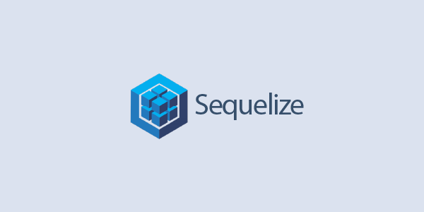

<center></center>

# 🍪 ORM

가장 먼저 ORM에 대해서 알아보자.

ORM(Object-Relational Mapping)은 데이터베이스와 데이터베이스 안의 테이블을 프로그래밍 할 때와 같이 객체처럼 쓸 수 있게 해주는 방식이다. 즉 이를 이용하면 직접 쿼리문을 날리지 않고, 객체의 형태로 데이터베이스에 접근해 객체를 삽입, 수정 등이 가능해진다. 대부분 개발 언어 플랫폼마다 제공되고 있으며, 대표적으로 spring에는 JPA, node.js에는 sequelize, 그리고 Django의 내장된 ORM이 있다.

## ORM의 장단점

### 🙉 장점

- 객체지향적인 코드로 더 직관적이고 비즈니스 로직에 더 집중할 수 있다.
- DBMS에 대한 종속성이 줄어든다.
- 재사용 및 유지보수의 편리성이 증가한다.
- 데이터베이스 마이그레이션을 쉽게 할 수 있다.

### 🙈 단점

- 모든 것을 ORM을 통해서만 구현하는 것은 힘들다.
- 프로시저가 많은 시스템에선 ORM의 객체 지향적인 장점을 활용하기 어렵다.
- 잘못 구현된 경우에 속도 저하 및 심각할 경우 일관성이 무너지는 문제점이 생길 수 있다.
- Raw Query보다 성능이 떨어진다.

# 🍪 Sequelize

<center></center>

Sequelize는 기본적으로 프로미스 기반(promise-based)으로된 Node.js ORM 이다. 지원하는 데이터베이스들은 다음과 같이 있다.

지원하는 RDBMS

- Postgres
- MySQL
- MariaDB
- SQLite
- Microsoft SQL Server.

Sequelize는 자바스크립트 구문을 알아서 SQL로 변환해준다. 어느 정도 문법이 호환되므로 동일한 ORM 코드를 사용하면서, 다른 데이터베이스로의 전환을 비교적 자유롭게 할 수 있다..

# 🍪 Sequelize로 테이블 만들기

[공식 문서](https://sequelize.org/master/index.html)를 바탕으로 Sequelize를 실습해보자.

## ⚙ 프로젝트 초기 세팅

프로젝트를 시작하고자 하는 디렉터리에서 node를 initialize 하자.

```
$ npm init -y
```

## 🏃 Sequelize 시작하기

sequelize와 sequelize에서 선택하고자 하는 데이터베이스 엔진을 수동으로 설치해준다. mysql를 통해 실습할 것이기 때문에 이에 맞게 설치해주자.

```
$ yarn add sequelize mysql2
```

### ◼ Sequelize에서 "선택"할 수 있는 RDBMS

<pre>
<code>
$ yarn add pg pg-hstore // Postgres
$ yarn add mysql2 // MySQL
$ yarn add mariadb // MariaDB
$ yarn add sqlite3 // SQLite
$ yarn add tedious // MS SQL Server
</code>
</pre>

### ◼ Sequelize CLI를 설치해 마이그레이션 준비하기

Sequelize의 마이그레이션을 활용하면 Git과 같은 버전제어가 가능해진다. 이를 이용하기 위해 `sequelize-cli`를 설치해주자.

```
$ yarn add global sequelize-cli
```

## 🕵 프로젝트 Bootstrapping

프로젝트를 초기화하기위해 init 명령어를 입력해주어야 하는데, 그 전에 프로젝트 최상위에 `.sequelizerc`를 추가해 sequelize config를 만들어 생성되는 디렉터리, 파일 구조를 미리 변경해주자.

```
/* .sequelizerc */
const path = require('path');

module.exports = {
    'config': path.resolve('src/db/config/config.js'),
    'models-path': path.resolve('src/db/models'),
    'seeders-path': path.resolve('src/db/seeders'),
    'migrations-path': path.resolve('src/db/migrations')
}
```

```
$ npx sequelize init
```

위 명령을 실행했다면 다음과 같은 디렉터리들이 생성된다.

- config: DB서버와의 연결설정을 기술하고, 그 설정을 cli에 알려준다.
- models: 테이블의 스키마를 정의해주는 곳으로 cli가 이 파일을 참조하여 마이그레이션 파일을 생성한다.
- migrations: 실제로 cli가 DB서버에 테이블을 만들게 한다.
- seeders: 실제 데이터들을 넣으며, cli가 이를 보고 DB의 테이블에 데이터를 넣는다.

현재까지 프로젝트 구조를 보면 다음과 같다.

<pre>
<code>
.
├── node_modules
└── src
    ├── db
    │   ├── config
    │   │   └── config.js
    │   ├── migrations
    │   ├── models
    │   │   └── index.js
    │   └── seeders
    └── index.js
├── .sequelizerc
├── package.json
├── yarn.lock
├── yarn-error.log
</code>
</pre>

### 🔥 ① config 설정

해당 파일은 DB서버와의 연결 설정을 기술하는 곳이라고 했었다. `config.js`파일을 보면 기본적으로 json형식으로 되어있는데, js형식으로 다음처럼 전부 바꿔주자.

```
/* config.js */
{
  "development": {
    "username": "root",
    "password": null,
    "database": "database_development",
    "host": "127.0.0.1",
    "dialect": "mysql"
  },
  "test": {
    "username": "root",
    "password": null,
    "database": "database_test",
    "host": "127.0.0.1",
    "dialect": "mysql"
  },
  "production": {
    "username": "root",
    "password": null,
    "database": "database_production",
    "host": "127.0.0.1",
    "dialect": "mysql"
  }
}
```

보여선 안되는 정보인 패스워드는 위와같이 env로 설정하자. 그리고 development, test, production 이렇게 총 3가지 모드를 가지며, 기본적으로 development을 사용한다. 이 역시도 `models/index.js`에 env파일을 통해 환경변수로 설정되어있다.

#### ⚙ env 설정

env파일을 다루는 방법은 [dotenv](https://www.npmjs.com/package/dotenv)를 설치해 .env파일을 만들어 .gitignore를 통해 관리하거나, export 명령어를 통해 설정 할 수 있다. 간단하게 export 명령어를 사용하자.

만약 모드를 변경하고자 한다면 다음과 같이 바꿔줄 수 있다.

```
$ export NODE_ENV=development //개발용
$ export NODE_ENV=test //테스트용
$ export NODE_ENV=production //배포용
```

`username`과 `password`에는 mysql 계정을 입력해주고, `database`에는 사용하고자 하는 Database를 작성해준다.

또한 sequelize-cli는 default로 mysql을 다루며, 다른 RDBMS를 다룬다면 `dialect`값을 변경 해주어야한다.

### 🔥 ② DB 생성

생성한 데이터베이스가 없다면 config 설정에 따른 데이터베이스를 생성해주면 된다.

```
$ npx sequelize db:create
...
Database mydb created.
```

### 🔥 ③ 모델 생성

여기까지 했다면, 이제 첫번째 마이그레이션을 만들 준비가 된 것이다. 모델을 생성하기 전에 이미 models 안에 index.js파일이 있을 것이다. 이 파일에 대한 설명은 [ZeroCho | models index.js 파일 설명](https://youtu.be/vMXnXXfFm-I?t=327)에서 볼 수 있다.

`model:generate`를 통해 모델을 생성해주자. 여기서 만약 모델을 잘못 생성했을 경우, 생성된 파일을 직접 수정하거나 삭제 후 명령을 다시 실행할 수 있다.

(OPTION: name: 모델 명, attributes: 모델 속성)

> 📖 User는 여러개의 Comment를 가지고, Comment는 하나의 User를 가진다. (One-To-Many)

```
$ npx sequelize model:generate --name User --attributes name:string,email:string
$ npx sequelize model:generate --name Comment --attributes comment:text,userId:integer
```

> 💡 id, createdAt, updatedAt 필드는 자동으로 생성된다.

```
/* models/user.js */
"use strict";
const { Model } = require("sequelize");
module.exports = (sequelize, DataTypes) => {
  class User extends Model {
    static associate(models) {
      // define association here
    }
  }
  User.init(
    {
      name: DataTypes.STRING,
      email: DataTypes.STRING,
    },
    {
      sequelize,
      modelName: "User",
    }
  );
  return User;
};
```

여기서 init 메서드는 테이블에 대한 설정을 하고, associate메서드에는 다른 모델과의 관계(1:1, 1:N, N:N)를 적는다.

#### 💡 MySQL vs 시퀄라이즈 자료형

| MySQL         | 시퀄라이즈                  |
| ------------- | --------------------------- |
| VARCHAR(100)  | STRING(100)                 |
| INT           | INTEGER                     |
| TINYINT       | BOOLEAN                     |
| DATETIME      | DATE                        |
| INT UNSIGNED  | INTEGER.UNSIGNED            |
| NOT NULL      | allowNull: false            |
| UNIQUE        | unique: true                |
| DEFAULT now() | defaultValue: Sequelize.NOW |

### 🔥 ④ Association 설정

Sequelize의 [Association](https://sequelize.org/master/manual/assocs.html)은 관계형 데이터베이스의 JOIN과 같이 관계성을 갖는 데이터들을 처리하기 위해 사용하는 것이다. 즉 1:1, 1:N, N:N의 관계를 정의해주는 곳이다.

#### 💡 Type

- HasOne
- BelongsTo
- HasMany
- BelongsToMany

<pre>
<code>
1:1 관계 를 구현하기 위해 hasOne와 belongsTo이 함께 사용
1:N 관계 를 구현하기 위해 hasMany와 belongsTo이 함께 사용
N:N 관계 를 구현하기 위해 두 개의 belongsToMany이 함께 사용
</code>
</pre>

models 파일에서 테이블들의 association를 다음과 같이 작성해주자.

```
/* models/user.js */
...
static associate(models) {
  this.hasMany(models.Comment, { foreignKey: "userId", sourceKey: "id" });
}
...
```

```
/* models/comment.js */
...
static associate(models) {
  this.belongsTo(models.User, { foreignKey: "userId", targetKey: "id" });
}
...
```

위에서 associate를 설정하기 위해 model들을 변경했었는데, migrations 디렉터리에 있는 파일 역시도 직접 수정해줘야 데이터베이스에 같은 설정으로 삽입된다.

```
/* migrations/[comment의 마이그레이션 파일] */
...
userId: {
  type: Sequelize.INTEGER,
  references: {
    model: "Users",
    key: "id",
  }
}
...
```

### ⑤ 마이그레이션 실행

모델만 생성했다고 실제 데이터베이스에 값이 삽입되지않는다. 위 작업을 통해 마이그레이션을 실행할 수 있는 준비를 끝마쳤기 때문에, `db:migrate` 명령을 실행해 마이그레이션을 실행해준다.

```
$ npx sequelize db:migrate
```

성공했다면 데이터베이스에 정상적으로 테이블이 만들어졌을 것이다.

#### 🤔 만약 마이그레이션을 취소하려면??

마이그레이션 undo하면 down이 실행되고 모두 취소할려면 뒤에 all만 붙여주면 된다.

```
$ npx sequelize db:migrate:undo // 가장 최근 마이그레이션 취소
$ npx sequelize db:migrate:undo:all // 모든 마이그레이션 취소
```

> undo를 실행하면 마이그레이션 파일의 down 메서드가 실행된다.

여기까지 마이그레이션을 완료했다면 설정했던 데이터베이스에 테이블이 다음과 같이 정상적으로 생성됨을 볼 수 있다.

<center></center>

## 🔍 Reference

- [graphql-seoul | 마이그레이션과 Sequelize-CLI 튜토리얼](https://medium.com/graphql-seoul/%EB%B2%88%EC%97%AD-%EB%A7%88%EC%9D%B4%EA%B7%B8%EB%A0%88%EC%9D%B4%EC%85%98%EA%B3%BC-sequelize-cli-%ED%8A%9C%ED%86%A0%EB%A6%AC%EC%96%BC-3926c0a9eae6)
- [eddev | Sequelize-cli와 PostgreSQL를 이용해서 데이터 Migration 및 Seed하기](https://velog.io/@eddie_kim/Sequelize-cli%EC%99%80-PostgreSQL%EB%A5%BC-%EC%9D%B4%EC%9A%A9%ED%95%B4%EC%84%9C-%EB%8D%B0%EC%9D%B4%ED%84%B0-Migration-%EB%B0%8F-Seed%ED%95%98%EA%B8%B0)
- [윤자이 | Sequelize : ORM(Object-relational Mapping) 사용해보기](https://ooeunz.tistory.com/71)
- [jeff0720 | Sequelize CLI를 사용하여 User API 만들기](https://velog.io/@jeff0720/Sequelize-CLI%EB%A5%BC-%EC%82%AC%EC%9A%A9%ED%95%98%EC%97%AC-%EA%B0%84%EB%8B%A8%ED%95%9C-User-API-%EB%A7%8C%EB%93%A4%EA%B8%B0-vdjpb8nl0k)
