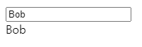
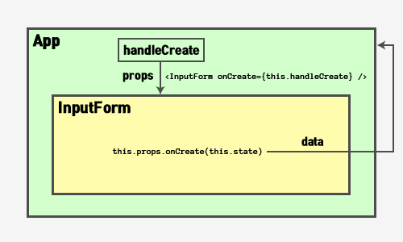
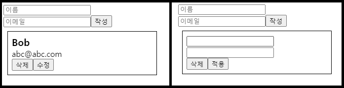
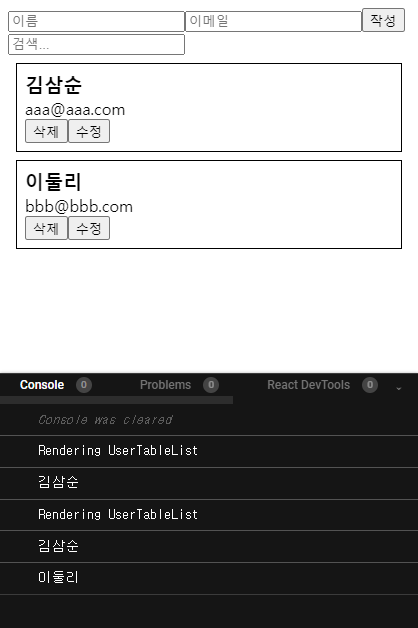
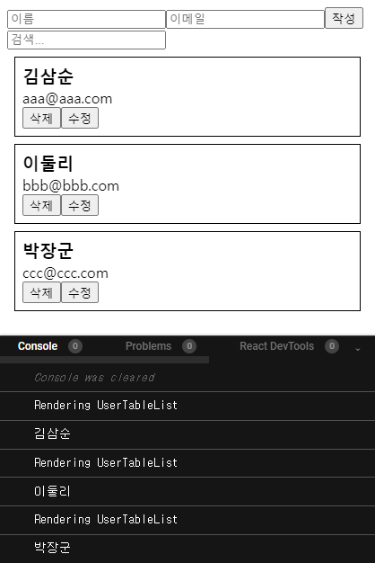

# 🍪 input 상태 다루기

다음과 같은 Input 태그가 있다.

```
import React, { Component } from "react";

class App extends Component {
  render() {
    return (
      <form>
        <input/>
      </form>
    );
  }
}

export default App;
```

이 Input 데이터를 다루기 위해서 가장 먼저, state를 선언하고 이를 다룰 수 있는 input의 onChange함수로 이 값을 다뤄줄 수 있을 것이다.

```
state = {
  name: '',
}
```

```
<input onChange={this.handleChange} />
```

그리고, input의 value값을 state로 설정을 해주면, `e.target.value`를 통해 값을 받아올 수 있다.

이러면 이제 아래처럼 해주면 input에 값을 입력되는 value에 따라 화면에 나타날 수 있다.

```
import React, { Component } from "react";

class App extends Component {
  state = {
    name: '',
  }

  handleChange = (e) => {
    this.setState({
      name: e.target.value
    })
  }

  render() {
    return (
      <div>
        <input onChange={this.handleChange} value={this.state.value}/>
        <div>{this.state.name}</div>
      </div>
    );
  }
}

export default App;
```

<center></center>

## 🤔 input 값이 여러개라면??

그렇다면 만약 input 값이 여러개라면 어떻게 다룰 수 있을까??

input에 name값을 설정해준 후 setState를 호출할 때 `[e.target.name]: e.target.value`를 적어서 다중 Input값을 다룰 수 있다.

<iframe src="https://codesandbox.io/embed/input-manage-4g3s1?fontsize=14&hidenavigation=1&theme=dark"
     style="width:100%; height:500px; border:0; border-radius: 4px; overflow:hidden;"
     title="input manage"
     allow="accelerometer; ambient-light-sensor; camera; encrypted-media; geolocation; gyroscope; hid; microphone; midi; payment; usb; vr; xr-spatial-tracking"
     sandbox="allow-forms allow-modals allow-popups allow-presentation allow-same-origin allow-scripts"
   ></iframe>

# 🍪 배열 데이터 렌더링 및 다루기

배열의 데이터를 렌더링 및 다루는 과정들 다음과 같은 목차로 알아볼 것이다.

1. [배열에 데이터 삽입하기](#insert)
2. [배열 렌더링하기](#rendering)
3. [배열에서 데이터 삭제하기](#delete)
4. [배열에서 데이터 수정하기](#modify)
5. [배열에서 데이터 검색하기](#search)

그전에 먼저 컴포넌트에서 값을 전달하는 과정을 한번 보자.

## 자식 컴포넌트가 부모한테 값 전달하기

자식 컴포넌트에서 부모에게 값을 전달할 때에는 부모 컴포넌트에서 state를 다룰 수 있는 handle 함수를 만든 후, 자식에게 props로 전달해서 자식이 이를 호출시켜서 값을 다룰 수 있게해주면 된다.

<center></center>

먼저 다음과 같이 부모 컴포넌트인 App에서 자식에서 내려줄 handle 함수를 props를 통해 내보내준다.

```
import React, { Component } from "react";
import InputForm from "./InputForm";

class App extends Component {
  handleCreate = (data) => {
    console.log(data);
  }
  render() {
    return (
      <>
        <InputForm onCreate={this.handleCreate} />
      </>
    );
  }
}

export default App;
```

그리고 자식 컴포넌트인 InputForm에서 받아온 handle함수를 호출하면 다음과 같이 자식의 state값을 부모에게 나타낼 수 있다.

```
import React, { Component } from "react";

class InputForm extends Component {
  state = {
    name: "",
    email: ""
  };

  handleChange = (e) => {
    this.setState({
      [e.target.name]: e.target.value
    });
  };

  handleSubmit = (e) => {
    e.preventDefault(); //새로고침 방지
    this.props.onCreate(this.state);
  };

  render() {
    return (
      <form onSubmit={this.handleSubmit}>
        <input
          name="name"
          onChange={this.handleChange}
          value={this.state.value}
          placeholder="이름"
        />
        <input
          name="email"
          onChange={this.handleChange}
          value={this.state.email}
          placeholder="이메일"
        />
        <button type="submit">작성</button>
      </form>
    );
  }
}

export default InputForm;
```

## ① 배열에 데이터 삽입하기 <a id="insert"></a>

위에선 단순히 data를 출력만 했는데, 이제부터 본격적으로 이 data들을 배열에 삽입하는 방법을 알아보자.

먼저, App에서 값을 담을 state를 선언해준 후, setState를 통해 값을 삽입하면 된다. 값을 삽입할 때 주의할 점은 불변성을 유지시켜줘야 하는 것이다.

```
state = {
  users: []
};
```

```
handleCreate = (data) => {
  this.setState({
    users: this.state.users.concat(data)
  });
};
```

[](https://codesandbox.io/s/managedata01-5y2qg?fontsize=14&hidenavigation=1&theme=dark)

### 💾 id 삽입하기

여기까지만 해주면 데이터는 불변성을 유지하며 `users 배열`에 값이 정상적으로 삽입될 것이다. 그렇다면, 만약 각 데이터에 고유한 `id`를 삽입해주고 싶을때는 어떻게 할 수 있을까??

일단은 넣어줄 id값이 선언되있다고 가정하자. id값은 렌더링될 값이 아니므로 굳이 state를 통해 다루지 않아도 된다.

```
id = 0;
```

`users 배열`에 자식에게 받아온 값과 id값을 함께넣기 위해선 이 역시도 불변성을 유지하면서 값을 삽입해야 될 것이다. 이를 위해선 여러가지 방법이 있다.

- Spread 연산자 활용

```
handleCreate = (data) => {
  this.setState({
    users: this.state.users.concat({
      ...data,
      id: this.id++
    })
  });
};
```

- Object.assign() 활용

```
handleCreate = (data) => {
  this.setState({
    users: this.state.users.concat(
      Object.assign({}, data, {
        id: this.id++
      })
    )
  });
};
```

<iframe src="https://codesandbox.io/embed/managedata02-cx8ir?fontsize=14&hidenavigation=1&theme=dark"
     style="width:100%; height:500px; border:0; border-radius: 4px; overflow:hidden;"
     title="managedata_02"
     allow="accelerometer; ambient-light-sensor; camera; encrypted-media; geolocation; gyroscope; hid; microphone; midi; payment; usb; vr; xr-spatial-tracking"
     sandbox="allow-forms allow-modals allow-popups allow-presentation allow-same-origin allow-scripts"
   ></iframe>

## ② 배열 렌더링하기 <a id="rendering"></a>

이제 `users 배열`을 컴포넌트로 변환해서 화면에 나타내보자.

2개의 컴포넌트를 생성해서 나타낼 것이다.

1. UserTableList
2. UserTable

### 📄 App에서 UserTableList 렌더링 해주기

가장 먼저, UserTableList를 App에서 렌더링하면서 `users 배열`값을 props로 전달해준다.

```
/* App.js */
return (
  <>
    <InputForm onCreate={this.handleCreate} />
    <UserTableList users={this.state.users} />
  </>
);
```

### 📄 UserTableList에서 map함수를 통한 배열 값 렌더링

UserTableList에서 map함수를 통해 UserTable들을 생성할 것이다.

```
/* UserTableList.js */
import React, { Component } from "react";
import UserTable from "./UserTable";

class UserTableList extends Component {
  render() {
    const { users } = this.props;
    return (
      <>
        {users.map((user) => (
          <UserTable key={user.id} user={user} />
        ))}
      </>
    );
  }
}

export default UserTableList;
```

> `key`값은 리액트에서 배열을 렌더링할 때 업데이트 성능을 최적화해준다. 📚[공식 문서 | Key](https://ko.reactjs.org/docs/lists-and-keys.html#keys)

하지만 위와같이 해주면, 만약 App에서 받아오는 데이터가 없을때 비구조화 할당을 통해 내부의 값을 받아올 수 없을 것이다. 이때 `TypeError`가 나서 컴포넌트가 크래쉬 된다. 그래서 users가 없을 때를 대비해 미리 설정해줘야 한다.

```
return (
  <>
    {users && users.map((user) =>
      <UserTable key={user.id} user={user} />
    )}
  </>
);
```

❗만약 key값을 index를 통해 설정을 해주면, 단순히 경고만 감출 뿐이고 성능상으로는 key가 없는것과 동일하다.

```
❌❌❌❌❌❌❌❌❌❌❌❌❌❌❌❌❌
{users.map((user, index) => (
  <UserTable key={index} user={user} />
))}
❌❌❌❌❌❌❌❌❌❌❌❌❌❌❌❌❌
```

### 📄 받아온 각 User 값을 UserTable에 나타내기

```
import React, { Component } from "react";

class UserTable extends Component {
  render() {
    const { name, email } = this.props.user;
    return (
      <div>
        <div>{name}</div>
        <div>{email}</div>
      </div>
    );
  }
}

export default UserTable;
```

<iframe src="https://codesandbox.io/embed/managedata03-neqmj?fontsize=14&hidenavigation=1&theme=dark"
     style="width:100%; height:500px; border:0; border-radius: 4px; overflow:hidden;"
     title="managedata_03"
     allow="accelerometer; ambient-light-sensor; camera; encrypted-media; geolocation; gyroscope; hid; microphone; midi; payment; usb; vr; xr-spatial-tracking"
     sandbox="allow-forms allow-modals allow-popups allow-presentation allow-same-origin allow-scripts"
   ></iframe>

## ③ 배열에서 데이터 삭제하기 <a id="delete"></a>

배열에서 데이터를 삭제하기 위해, 기존의 배열 데이터를 건들이지 않는, 즉 불변성을 유지하면서 값을 삭제해야한다. 대표적으로 slice와 concat을 이용하는 방법과 filter를 이용하는 방법이 있다. filter를 사용한 방법을 간단하게 보면 다음과 같다.

```
/* 3인 값만 제거하기 */
const data = [1, 2, 3, 4, 5];
data.filter(n => n !== 3); //[1, 2, 4, 5]
```

### 📄 App에서 handleRemove 추가하기

```
/* App.js */
handleRemove = (id) => {
  const { users } = this.state;
  this.setState({
    users: users.filter(user => user.id !== id)
  })
}
```

이렇게 추가한 함수는 props를 통해 전달해준다.

```
<UserTableList
  users={this.state.users}
  onRemove={this.handleRemove}
/>
```

### 📄 전달받은 함수를 UserTableList에서 UserTable로 전달하기

```
/* UserTableList.js */
const { users, onRemove } = this.props;
return (
  <>
    {users &&
      users.map((user) => (
        <UserTable
          key={user.id}
          user={user}
          onRemove={onRemove}
        />
      ))}
  </>
);
```

### 📄 UserTable에서 제거버튼 만들기

제거 버튼에 onClick을 추가해 함수를 호출하면된다.

```
/* UserTable.js */
import React, { Component } from "react";

class UserTable extends Component {
  handleRemove = () => {
    const { user, onRemove } = this.props;
    onRemove(user.id);
  };

  render() {
    const { name, email } = this.props.user;
    return (
      <div style={{ border: "1px solid black", padding: "8px", margin: "8px" }}>
        <div style={{ fontSize: "1.2rem", fontWeight: "bold" }}>{name}</div>
        <div>{email}</div>
        <button onClick={this.handleRemove}>삭제</button>
      </div>
    );
  }
}

export default UserTable;
```

<iframe src="https://codesandbox.io/embed/managedata04-ivojd?fontsize=14&hidenavigation=1&theme=dark"
     style="width:100%; height:500px; border:0; border-radius: 4px; overflow:hidden;"
     title="managedata_04"
     allow="accelerometer; ambient-light-sensor; camera; encrypted-media; geolocation; gyroscope; hid; microphone; midi; payment; usb; vr; xr-spatial-tracking"
     sandbox="allow-forms allow-modals allow-popups allow-presentation allow-same-origin allow-scripts"
   ></iframe>

## ④ 배열에서 데이터 수정하기 <a id="modify"></a>

데이터 수정도 마찬가지로 불변성 지켜주면서 작업해줘야 한다. 이 작업 역시 map을 통해서 간단하게 구현 가능한데 예시를 보자.

다음과 같은 데이터가 있다.

```
let arr = [
  { id: 0, data: "a"},
  { id: 1, data: "b"},
  { id: 2, data: "c"}
]
```

map과 삼항연산자 그리고 Spread 연산자를 통해 불변성을 유지시키며 값을 수정할 수 있다.

```
arr.map(n => n.id === 1 ?
  ({ ...n, data: "z"}) // 일치하는 id값의 원하는 data만 변경
  : n //기존 값은 그대로 두기
  )
//{id: 0, data: "a"}
//{id: 1, data: "z"}
//{id: 2, data: "c"}
```

### 📄 App에서 handleUpdate 추가 후 UserTable까지 전달하기

```
/* App.js */
handleUpdate = (id, data) => {
  const { users } = this.state;
  this.setState({
    users: users.map((user) => (user.id === id ? { ...user, ...data } : user))
  });
};
```

마찬가지로 추가한 함수를 props를 통해 전달해준다.

```
<UserTableList
  users={this.state.users}
  onRemove={this.handleRemove}
  onUpdate={this.handleUpdate}
/>
```

```
/* UserTableList.js */
<UserTable
  key={user.id}
  user={user}
  onRemove={onRemove}
  onUpdate={onUpdate}
/>
```

### 📄 UserTable에서 수정 버튼 만들기

UserTable에서 state와 handleToggleEdit 함수를 추가해 수정 toggle을 구현해볼 것이다.

```
/* UserTable.js */
state = {
  isEdit: false
};
```

```
handleToggleEdit = () => {
  this.setState({
    isEdit: !this.state.isEdit
  });
};
```

그리고 이어서 삼항연산자를 통해 isEdit의 값에 따라 렌더링을 달리 해줄 것이다.

```
/* UserTable.js */
import React, { Component } from "react";

class UserTable extends Component {
  state = {
    isEdit: false
  };

  handleRemove = () => {
    const { user, onRemove } = this.props;
    onRemove(user.id);
  };

  handleToggleEdit = () => {
    this.setState({
      isEdit: !this.state.isEdit
    });
  };

  render() {
    const { name, email } = this.props.user;
    const { isEdit } = this.state;
    return (
      <div style={{ border: "1px solid black", padding: "8px", margin: "8px" }}>
        {isEdit ? (
          <>
            <div>
              <input />
            </div>
            <div>
              <input />
            </div>
          </>
        ) : (
          <>
            <div style={{ fontSize: "1.2rem", fontWeight: "bold" }}>{name}</div>
            <div>{email}</div>
          </>
        )}
        <button onClick={this.handleRemove}>삭제</button>
        <button onClick={this.handleToggleEdit}>
          {isEdit ? "적용" : "수정"}
        </button>
      </div>
    );
  }
}

export default UserTable;
```

이렇게만 해주면 아래와 같이 isEdit에 값에 따라 다른 결과물을 볼 수 있을 것이다.

<center></center>

하지만 아직 수정을 누른 후, input에 값을 넣고 적용했을때 수정해주는 로직을 만들지 않았다. 이 작업은 `input 상태 다루기`에서 했던 작업과 거의 유사하다.

일단 먼저, state값을 추가해준 후, 핸들러함수와 input과 연결해준다.

```
/* UserTable.js */
state = {
  isEdit: false,
  name: '',
  email: '',
}
```

```
handleChange = e => {
  this.setState({
    [e.target.name]: e.target.value
  });
};
```

```
<div>
  <input
    name="name"
    onChange={this.handleChange}
    value={this.state.name}
  />
  </div>
  <div>
  <input
    name="email"
    onChange={this.handleChange}
    value={this.state.email}
  />
</div>
```

그리고 handleToggleEdit에서 isEdit이 변경되는 값에 따른 2가지 로직을 생각해야한다.

1. true → false: onUpdate
2. false → true: state에 user값들 넣어주기

```
handleToggleEdit = () => {
  const { user, onUpdate } = this.props;
  const { isEdit } = this.state;
  isEdit
    ? // true → false: onUpdate
      onUpdate(user.id, {
        name: this.state.name,
        email: this.state.email
      })
    : // false → true: state에 user값들 넣어주기
      this.setState({
        name: this.state.name,
        email: this.state.email
      });
  this.setState({
    isEdit: !this.state.isEdit
  });
};
```

<iframe src="https://codesandbox.io/embed/managedata05-v1vc1?fontsize=14&hidenavigation=1&theme=dark"
     style="width:100%; height:500px; border:0; border-radius: 4px; overflow:hidden;"
     title="managedata_05"
     allow="accelerometer; ambient-light-sensor; camera; encrypted-media; geolocation; gyroscope; hid; microphone; midi; payment; usb; vr; xr-spatial-tracking"
     sandbox="allow-forms allow-modals allow-popups allow-presentation allow-same-origin allow-scripts"
   ></iframe>

## 배열에서 데이터 검색하기 <a id="search"></a>

추가해준 데이터를 바탕으로 검색하는 것은 위에서 했던 것들을 조금만 활용하면 만들 수 있다.

App.js에서 keyword state만 추가한 후 이를 다룰 수 있는 핸들러 함수와 input을 연결해 준후 단순히 UserTableList에 props를 내려보낼 때 filter시키면 된다.

```
/* App.js */
state = {
  users: [],
  keyword: ""
};
```

```
handleChange = (e) => {
  this.setState({
    keyword: e.target.value
  });
};
```

```
<>
  <InputForm onCreate={this.handleCreate} />
  <input
    value={this.state.keyword}
    onChange={this.handleChange}
    placeholder="검색..."
  />
  <UserTableList
    users={this.state.users.filter((user) =>
      user.name.includes(this.state.keyword)
    )}
    onRemove={this.handleRemove}
    onUpdate={this.handleUpdate}
  />
</>

```

<iframe src="https://codesandbox.io/embed/managedata06-vxw8q?fontsize=14&hidenavigation=1&theme=dark"
     style="width:100%; height:500px; border:0; border-radius: 4px; overflow:hidden;"
     title="managedata_06"
     allow="accelerometer; ambient-light-sensor; camera; encrypted-media; geolocation; gyroscope; hid; microphone; midi; payment; usb; vr; xr-spatial-tracking"
     sandbox="allow-forms allow-modals allow-popups allow-presentation allow-same-origin allow-scripts"
   ></iframe>

# 🍪 최적화하기

각 코드에 console.log를 찍어 렌더링될때마다 무엇이 찍히는지 확인해보자.

```
/* UserTableList.js*/
render() {
  const { users, onRemove, onUpdate } = this.props;
  console.log('Rendering UserTableList');
  return (
```

```
/* UserTable.js*/
...
render() {
  const { name, email } = this.props.user;
  const { isEdit } = this.state;
  console.log(name);
  return (
...
```

<center></center>

값을 추가할 때마다 "Rendering UserTableList"가 발생하는데, 기존에 있던 데이터도 한번 더 렌더링된다. 굳이 추가되지 않은 데이터를 렌더링 시킬필요가 없는데, 이때 shouldComponentUpdate를 통해 최적화를 시킬 수 있다.

## 🧹 shouldComponentUpdate를 통한 최적화

여기서 하고자하는 작업은 업데이트가 불필요할 때에는 업데이트 하지않는 것이다.

```
/* UserTable.js*/
shouldComponentUpdate(nextProps, nextState) {
  if(this.state !== nextState){
    return true;
  }
  return this.props.user !== nextProps.user;
}
```

현재 오는값과 다음으로 오는 값이 다를 경우에만 업데이트가 일어난다.

<center></center>

## 🔍 Reference

- [velopert | 배열 다루기](https://react-anyone.vlpt.us/07.html)
- [공식 문서 | Key](https://ko.reactjs.org/docs/lists-and-keys.html#keys)
