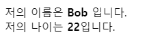
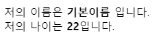
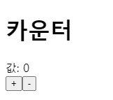

# 🍪 Props

Props는 부모 컴포넌트가 자식 컴포넌트한테 전달하는 값이다. 새로운 컴포넌트를 만들면서 이해해보자.

## 👶 새로운 컴포넌트 (자식) 만들기

만들어 볼 데이터구조는 다음과 같다. 먼저, `클래스형 컴포넌트`를 통해 작성할 것이다.

<pre>
<code>
src
├── App // Parent
├── Profile // Children
├── index 
</code>
</pre>

그럼 이제, src 디렉터리에 Profile 이라는 컴포넌트를 다음과 같이 만들어보자.

```
import React, { Component } from "react";

class Profile extends Component {
  render(){
    return(
      <>
        <div>저의 이름은 <b>{this.props.name}</b> 입니다.</div>
        <div>저의 나이는 <b>{this.props.age}</b> 입니다.</div>
      </>
    )
  }
}

export default Profile;
```

위 코드와 같이 모든 컴포넌트는 render()를 가지고, render()는 JSX를 리턴해야한다.

> 리액트는 JSX 문법을 사용 시에 return 안에는 반드시 하나의 최상위 태그가 있어야 한다. 즉 리액트는 하나의 컴포넌트만을 리턴할 수 있기 때문에 의미없는 div와 같은 컴포넌트로 묶어주는 것 보다 Fragments를 통해 묶어 줄 수 있다. `Fragments`는 DOM에 별도의 노드 추가 없이 여러 자식을 그룹화 할 수 있다. 자세한 내용은 공식 문서에서 볼 수 있다.
>
> > 📚 [공식문서 | Fragments](https://ko.reactjs.org/docs/fragments.html)

해당 자식이 부모에게서 받아온 Props값은 `this` 키워드를 통해 조회할 수 있다. 현재는 name과 age 2개의 Props를 받아올 수 있는 상태가 되었다.

## 🧔 App.js 파일 수정 (부모 설정)

기존에 있던 App.js에 import를 통해 자식 컴포넌트를 불러오고, 마치 태그의 속성을 설정해주듯이 Props값을 설정해주면 된다.

```
import React, { Component } from "react";
import Profile from './Profile';

class App extends Component {
  render(){
    return (
        <Profile name="Bob" age="22"/>
    );
  }
}

export default App;
```

<center></center>

## defaultProps

만약 그러면 부모에서 Props값을 실수로 넣지않았거나, 비워야되는 상황이 오는 경우 기본 Default 값을 설정 해줄 수는 없을까??

`<Profile age="22"/>`과 같이 name 값이 설정되지 않은 경우, 총 2가지 방법을 통해 defaultProps를 설정할 수 있다.

### 👣 static defaultProps

```
import React, { Component } from "react";

class Profile extends Component {
  static defaultProps = {
    name: '기본이름'
  }
  render() {
    return (
        {/*생략*/}
    );
  }
}

export default Profile;
```

### 👣 컴포넌트명.defaultProps

```
import React, { Component } from "react";

class Profile extends Component {
  render() {
    return (
        {/*생략*/}
    );
  }
}

Profile.defaultProps = {
  name: '기본이름'
};

export default Profile;

```

<center></center>

아래 링크에서 위에서 실습했던 코드를 테스트 해볼수 있다.

[](https://codesandbox.io/s/reactprops-bex2u?fontsize=14&hidenavigation=1&theme=dark)

## 함수형 컴포넌트로 나타내기

위에서 실습했던 내용 중 Profile을 클래스형 컴포넌트가 아닌 `함수형 컴포넌트`를 통해 나타내보자.

```
import React from "react";

const Profile = ({name, age}) => {
  return (
    <>
      <div>
        저의 이름은 <b>{name}</b> 입니다.
      </div>
      <div>
        저의 나이는 <b>{age}</b>입니다.
      </div>
    </>
  );
};

Profile.defaultProps = {
  name: "기본이름"
};

export default Profile;
```

위와 같이 함수형 컴포넌트를 만들게되면 리액트에서 Component를 불러올 필요가 없다. 그러나 React는 여전히 불러와야한다. 내부적으로 JSX가 만들어질때 React를 사용하기 때문이다.

## 클래스형 컴포넌트 vs 함수형 컴포넌트

### 👣 클래스형 컴포넌트

- render 함수가 반드시 존재해야한다.
- state 사용이 가능하다.
- 라이프 사이클 API 사용이 가능하다.

### 👣 함수형 컴포넌트

- 클래스형 컴포넌트에 비해 선언하기 편리하다.
- 메모리 자원을 클래스형 컴포넌트에 비해 덜 차지한다.
- 빌드 후 배포 시 결과물의 크기가 작다.

정리하자면, 함수형 컴포넌트는 state와 LifeCycle이 빠져있어서 컴포넌트 초기 마운트가 클래스형 컴포넌트 보다 미세하게 빠르다. 그래서 함수형 컴포넌트에서는 setState를 사용하지 못한다. 하지만, `React Hooks`을 통해 더 멋지게 state 관리와 LifeCycle 를 다룰 수 있다.

# 🍪 State

위에서 다뤘던 Props는 부모가 자식에게 내려주는 값이였고, 자식 입장에선 그 값이 읽기 전용이다. 반면 state는 컴포넌트 자기자신이 들고 있고, 그 값의 변화가 필요하다면 컴포넌트의 내장함수인 `setState()`를 통해 값을 변경할 수 있다.

## 🔢 새로운 컴포넌트(Counter) 만들기

이번엔 Counter 컴포넌트를 하나 만들어서 state를 다루는 법을 살펴보자. 클래스형 컴포넌트로 선언했으며, 아래와 같이 Counter.js를 만들고 App.js에서는 이를 불러오게 만들었다.

```
/* Counter.js */
import React, { Component } from "react";

class Counter extends Component {
  state = {
    number: 0
  } //①
  render() {
    return (
      <>
        <h1>카운터</h1>
        <div>값: {this.state.number}</div> //②
        <button>+</button>
        <button>-</button>
      </>
    );
  }
}

export default Counter;
```

```
/* App.js */
import React, { Component } from "react";
import Counter from "./Counter";

class App extends Component {
  render() {
    return <Counter />;
  }
}

export default App;
```

<center></center>

위와 같이 Counter 컴포넌트 중 ①에서 state를 정의해주었다. 그리고 state에 있는 값을 사용하기 위해선 ②와 같이 해주면 된다.

## ⚙ setState 및 이벤트 설정

하지만 현재는 증감버튼을 눌러도 아무작동을 하지않을 것이다. 이를 위해 커스텀 메서드를 만들어서 버튼에 이벤트를 설정해주어야한다.

```
import React, { Component } from "react";

class Counter extends Component {
  state = {
    number: 0
  }
  handleIncrease = () => {
    this.setState({
      number: this.state.number + 1
    })
  }

  handleDecrease = () => {
    this.setState({
      number: this.state.number- 1
    })
  }
  render() {
    return (
      <>
        <h1>카운터</h1>
        <div>값: {this.state.number}</div>
        <button onClick={this.handleIncrease}>+</button>
        <button onClick={this.handleDecrease}>-</button>
      </>
    );
  }
}

export default Counter;
```

❗ 여기서 주의할 점은 리액트에서는 아래와같이 state에 직접접근해서 변경하면 리렌더링 하지않기(라이프사이클 flow를 타지않기) 때문에 꼭 setState를 통해서 값을 변경해야된다는 것이다.

```
❌❌❌❌❌❌❌❌❌❌❌❌❌❌❌❌❌
handleIncrease = () => {
  this.state.number = this.state.number + 1;
}
❌❌❌❌❌❌❌❌❌❌❌❌❌❌❌❌❌
```

<iframe src="https://codesandbox.io/embed/state-cq4h2?fontsize=14&theme=dark&view=preview"
     style="width:100%; height:500px; border:0; border-radius: 4px; overflow:hidden;"
     title="state"
     allow="accelerometer; ambient-light-sensor; camera; encrypted-media; geolocation; gyroscope; hid; microphone; midi; payment; usb; vr; xr-spatial-tracking"
     sandbox="allow-forms allow-modals allow-popups allow-presentation allow-same-origin allow-scripts"
   ></iframe>

## 함수형 컴포넌트로 나타내기 (hooks)

함수형 컴포넌트에서는 setState를 사용하지 못한다고 했었다. 그러면 어떻게 state관리를 할 수 있을까? 함수형 컴포넌트에선 React Hooks의 useState를 통해 이를 관리할 수 있다.

```
import React, { useState } from "react";

const Counter = () => {
  const [number, setNumber] = useState(0);

  const handleIncrease = () => {
    setNumber(number+1);
  };

  const handleDecrease = () => {
    setNumber(number-1);
  };

    return (
      <>
        <h1>카운터</h1>
        <div>값: {number}</div>
        <button onClick={handleIncrease}>+</button>
        <button onClick={handleDecrease}>-</button>
      </>
    );

}

export default Counter;
```

Hooks에 대해서 깊게 들어가면 내용이 길어지니 간단하게 어떻게 코드가 구성되어있는지만 보자. 일단 위에서 작성한 코드는 클래스형 컴포넌트에서 작성했던 코드와 같은 동작을 한다.

가장 먼저 useState를 사용하기 위해선 import를 통해 불러와야 한다.

```
import React, { useState } from "react";
```

이러한 useState에 인자에는 number state에 대한 초기값이 들어가고, setNumber를 통해 setState와 같은 역할을 수행할 수 있다.

```
const [number, setNumber] = useState(0);
```

이처럼 state를 변수처럼 선언할 수 있으며, 훨씬 더 편리하게 다룰 수도 있다. 이처럼 React Hooks은 강력한데, 향후에 이에 대해서 다뤄보도록 해야겠다.

## 🔍 Reference

- [velopert | Props & State](https://velopert.com/3629)
