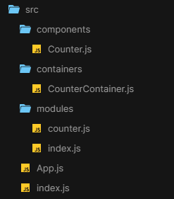
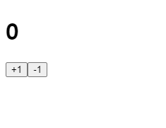
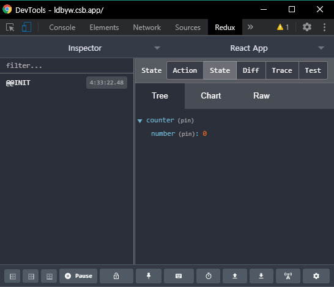

# 🍪 Redux 란 무엇인가??

리덕스는 리액트에서 가장 많이 사용하는 상태 관리 라이브러리이다. 리덕스를 사용하면 컴포넌트의 업데이트 관련 로직을 다른 파일로 분리시켜서 더욱 효율적으로 관리할 수 있다.

> 참고로, Redux는 React에 종속된 라이브러리로 많이들 생각하는데, Redux는 오픈소스 JavaScript 라이브러리이다. 이와 유사한 라이브러리로 MobX가 있다.

## 🤔 Redux 왜 사용하는가??

실제로 우리는 리덕스 없이도 컴포넌트 간에 데이터를 주고받는 것이 가능하다. 리액트는 `One-Way Data Flow`이지만, state 끌어올리기(state lifting)를 통해 자식 컴포넌트들은 부모 컴포넌트의 상태 변경을 일으킬 수 있었다.

<center></center>

하지만, 프로젝트 규모가 커지면 커질수록, 데이터 상태 관리는 매우 복잡해 질 것이다.

<center></center>

이러한 문제점을 보완하기 위해, 컴포넌트끼리 공유하는 상태를 전역 상태로 손쉽게 관리하게끔 해주는게 바로 상태 관리 라이브러리, 리덕스이다.

<center></center>

<center>🔎 <a href="https://medium.com/lunit/redux%EA%B0%80-%ED%95%84%EC%9A%94%ED%95%98%EB%8B%A4%EB%8A%94-%EA%B2%83%EC%9D%84-%EC%96%B8%EC%A0%9C-%EC%95%8C-%EC%88%98-%EC%9E%88%EB%82%98%EC%9A%94-426a148da64d">gif source</a></center>

> 리액트 v16.3이 릴리즈되면서 Context API를 통해서도 똑같은 작업을 취할 수 있다. 하지만 단순한 전역상태만 관리한다면 Context API를 사용해도 무방하지만, 프로젝트 규모가 매우 커졌을때 Redux를 사용하면, 코드 유지 보수성도 높여주고, Redux Tool과 미들웨어 기능도 지원하기에 더욱 효율적으로 관리 할 수 있다.

## 🤔 그렇다면 Redux는 어떻게 작동할까??

먼저 리덕스의 구조를 한번 보자.

### 📖 액션(Action)

리덕스에서 상태를 업데이트할 때, 이 액션을 보내는 것으로 시작해야한다. 액션은 하나의 객체로 표현되며, 상태 변화를 일으킬 때 참조된다.

### 📖 리듀서(Reducer)

리듀서는 상태 변화를 일으키는 함수로, 액션을 만들어서 리듀서가 전달받으면, 스토어를 어떻게 업데이트 할지를 기술하는 순수함수이다. 현재 상태와 전달받은 액션 객체를 파라미터로 받아온다. 이 리듀서에서 state의 변화가 일어난다.

### 📖 스토어(Store)

상태가 관리되는 공간, 여기에 애플리케이션에 대한 모든 정보와 상태가 담겨있다. React 컴포넌트는 스토어를 구독해서 스토어가 업데이트 될때마다 컴포넌트를 업데이트 할 수 있다.

### 📖 디스패치(Dispatch)

스토어의 내장 함수 중 하나로, 액션을 발생시킨다. 이 함수가 호출되면 스토어는 리듀서 함수를 실행시켜서 새로운 상태를 만들어 준다. 즉, 액션을 스토어에 전달해준다.

### 📖 구독(Subscribe)

스토어의 내장 함수 중 하나로, subscribe 함수 안에 리스너 함수를 파라미터로 넣어서 호출해 주면, 이 리스너 함수가 액션이 디스패치되어 상태가 업데이트 될 때마다 호출된다.

<center></center>

<center>🔎 <a href="https://velog.io/@hidaehyunlee/React-%EB%A6%AC%ED%8C%A9%ED%86%A0%EB%A7%81-4-%EC%98%88%EB%B0%9C%EC%9E%90-%ED%94%84%EB%A1%9C%EC%A0%9D%ED%8A%B8%EC%97%90-Redux-%EC%A0%81%EC%9A%A9%ED%95%98%EA%B8%B0">gif source</a></center>

## 리덕스의 3가지 규칙

### ✔ 읽기 전용 상태

리덕스의 상태는 `읽기 전용`이다. 리덕스는 내부적으로 데이터가 변경되는 것을 감지하기위해 얕은 비교 검사를 하므로, 값을 업데이트 할때 불변성을 유지 해줘야 한다.

### ✔ 단일 스토어

하나의 어플리케이션에는 `하나의 스토어`로 구성해줘야한다.

> 여러 개의 스토어를 만들 수도 있지만, 상태 관리가 복잡해질 수 있으므로 권장하지 않는다.

### ✔ 리듀서는 순수 함수로 작성

리듀서 함수는 항상 `순수 함수`로 작성해야한다. 파라미터 외의 값에는 의존하면 안되며, 이전 상태를 건드리지 않고, 변화를 준 새로운 상태 객체를 만들어서 반환해줘야 한다.

> 리듀서 함수 내부에서 랜덤 값을 만들거나, Date 함수로 날짜 받기, 네트워크 요청작업을 하면 안된다. 주로 네트워크 요청과 같은 비동기 작업은 미들웨어를 통해 관리한다.

# 🍪 만들면서 쉽게 이해하는 Redux

`Counter 예제`를 직접 만들어 보면서 Redux를 이해해보자. 순서는 다음과 같이 진행할 것이다.

1. [작업 환경 설정](#1)
2. [카운터 컴포넌트 생성](#2)
3. [카운터 리덕스 코드 작성하기](#3)
4. [리액트 애플리케이션에 리덕스 적용하기](#4)
5. [Redux DevTools 설치 및 적용](#5)
6. [카운터 컨테이너 생성](#6)

완성된 코드는 다음 링크에서 보면된다.

[](https://codesandbox.io/s/react-redux-counter-ldbyw?fontsize=14&hidenavigation=1&theme=dark)

## 🔥 작업 환경 설정 <a id="1"></a>

### ◼ CRA(create-react-app)으로 시작하기

<pre>
<code>
$ yarn create react-app react-redux-counter
</code>
</pre>

### ◼ redux 라이브러리 설치

설치 후 해당 디렉터리에서 yarn 명령어를 이용해 redux와 react-redux 라이브러리를 설치해주자.

<pre>
<code>
$ cd react-redux-counter
$ yarn add redux react-redux-counter
</code>
</pre>

## 🔥 카운터 컴포넌트 생성 <a id="2"></a>

시작하기에 앞서, 완성된 코드의 프로젝트 구조를 보면 다음과 같다. 이를 참고하면 더 쉽게 이해할 수 있다.

<center></center>

가장 먼저, 숫자(number)를 1씩 더하고 뺄 수 있는 카운터 컴포넌트를 만들어 보자. component 디렉터리에 Counter를 생성하자.

```
/* src/component/Counter.js */
import React from 'react';

const Counter = ({ number, onIncrease, onDecrease }) => {
  return (
    <div>
      <h1>{number}</h1>
      <button onClick={onIncrease}>+1</button>
      <button onClick={onDecrease}>-1</button>
    </div>
  );
};

export default Counter;
```

만든 카운터 컴포넌트를 App에서 렌더링하자.

```
/* src/App.js */
import React from 'react';
import Counter from './components/Counter';

const App = () => {
  return (
    <>
      <Counter number={0} />
    </>
  );
};

export default App;
```

개발 서버를 실행해보면 다음과 같은 실행화면을 볼 수 있다.

<center></center>

## 🔥 카운터 리덕스 코드 작성하기 <a id="3"></a>

### 🎨 리덕스 코드 패턴

리덕스를 다루기위해 우리가 만들어야될 코드는 `액션 타입`, `액션 생성 함수`, `리듀서 코드` 이렇게 3가지를 작성해야한다.

리덕스 코드를 작성하는 방법은 대표적으로 2가지가 있습니다.

1. 코드들을 각각 다른 파일에 분리해서 작성하는 방법 (일반적 패턴)
2. 기능별로 묶어서 파일 하나에 작성하는 방법 (Ducks 패턴)

`일반적 패턴`은 하나의 기능을 수정하기 위해 분리된 여러 파일을 참조해서 코드를 수정해야 되는 불편함이 생기는데, `Ducks 패턴`을 사용하면 하나의 파일만 다루면 되므로 좀 더 직관적인 코드 작성이 가능해진다.

아래 코드는 Ducks 패턴을 통해 작성할 것이다.

### ◼ 액션 타입 정의하기

modules 디렉터리에 리덕스 코드인 counter.js 파일을 작성해주자. 가장 먼저 해야될 작업은 액션 타입을 정의하는 것이다. 액션 타입은 `대문자`로 정의하고, 문자열 내용은 `모듈 이름/액션 이름`과 같은 형태로 작성(중복 방지)한다.

```
/* src/modules/counter.js */
/* ① 액션 타입 정의 */
const INCREASE = 'counter/INCREASE';
const DECREASE = 'counter/DECREASE';
```

### ◼ 액션 생성 함수 만들기

```
/* src/modules/counter.js */
/* ① 액션 타입 정의 */
const INCREASE = 'counter/INCREASE';
const DECREASE = 'counter/DECREASE';

/* ② 액션 생성 함수 만들기*/
export const increase = () => ({ type: INCREASE });
export const decrease = () => ({ type: DECREASE });
```

### ◼ 리듀서 함수 만들기

리듀서 함수를 작성할때에는 보통 초기 상태와 함께 만든다. 리듀서 함수가 제일 처음 호출 될 때는 state가 undefined이다. 이때 `initialState`을 기본값으로 사용한다. 그리고 action.type에 따라 다른 작업을 처리한다. 그리고 가장 중요한 점은 상태의 불변성을 유지하면서 데이터에 변화를 주어야 한다.

```
/* src/modules/counter.js */
/* ① 액션 타입 정의 */
const INCREASE = 'counter/INCREASE';
const DECREASE = 'counter/DECREASE';

/* ② 액션 생성 함수 만들기 */
export const increase = () => ({ type: INCREASE });
export const decrease = () => ({ type: DECREASE });

/* ③ 리듀서 함수 만들기 */
const initialState = {
  number: 0
};

function counter(state = initialState, action) {
  switch (action.type) {
    case INCREASE:
      return {
        ...state,
        number: state.number + 1
      };
    case DECREASE:
      return {
        ...state,
        number: state.number - 1
      };
    default:
      return state;
  }
}
export default counter;
```

### ◼ 루트 리듀서 만들기

만약, 프로젝트에서 여러 리듀서를 작성했었다고 가정해보자. 이후 스토어를 만들 때 createStore 함수를 통해 리듀서 하나만 작성해야되는데, 그러기 위해선 여러 리듀서들을 하나로 합쳐주는 작업이 필요하다. 이 작업은 리덕스에서 제공하는 `combineReducers`라는 유틸 함수를 사용하면 쉽게 처리할 수 있다.

modules 디렉터리에 index.js파일에 해당 구문을 넣어주자.

```
/* src/modules/index.js */
import { combineReducers } from 'redux';
import counter from './counter';

const rootReducer = combineReducers({
  counter
});

export default rootReducer;
```

🧪 만약 todo 리듀서를 한개 더 받아와서 합치고자 할때에는 다음과 같이 해주면 된다.

```
/* Example */
const rootReducer = combineReducers({
  counter,
  todos
});
```

## 🔥 리액트 애플리케이션에 리덕스 적용하기 <a id="4"></a>

### ◼ 스토어 만들기

스토어를 만들 때는 `createStore` 함수를 사용한다. 이를 사용하기 위해선 모듈을 불러와야하며, 함수의 파라미터에는 리듀서 함수를 넣어줘야 한다.

```
/* src/modules/index.js */
import React from 'react';
import ReactDOM from 'react-dom';
import { createStore } from 'redux';
import App from './App';
import rootReducer from './modules';

const store = createStore(rootReducer); // 스토어 생성

const rootElement = document.getElementById('root');
ReactDOM.render(<App />, rootElement);
```

### ◼ 프로젝트에 리덕스 적용

`Provider` 컴포넌트를 사용해 프로젝트에 리덕스를 적용해줘야한다.

```
/* src/modules/index.js */
import React from 'react';
import ReactDOM from 'react-dom';
import { createStore } from 'redux';
import { Provider } from 'react-redux';
import App from './App';
import rootReducer from './modules';

const store = createStore(rootReducer); // 스토어 생성

const rootElement = document.getElementById('root');
ReactDOM.render(
  <Provider store={store}>
    <App />
  </Provider>,
  rootElement
);
```

## 🔥 Redux DevTools 설치 및 적용 <a id="5"></a>

[Redux DevTools](https://chrome.google.com/webstore/detail/redux-devtools/lmhkpmbekcpmknklioeibfkpmmfibljd?hl=ko&)은 리덕스 개발자 도구로, 크롬 확장 프로그램으로 설치해서 사용할 수 있다.

프로젝트에 적용시키기 위해서는 2가지 방법이 있다.

### ☝ [First way] 코드만 삽입

```
const = createStore(
  rootReducer,
  window.__REDUX_DEVTOOLS_EXTENSION_COMPOSE__ &&
  window.__REDUX_DEVTOOLS_EXTENSION_COMPOSE__()
);
```

### ✌ [Second way] 패키지 설치 후 간단한 코드 삽입

<pre>
<code>
$ yarn add redux-devtools-extension
</code>
</pre>

```
/* src/modules/index.js */
import React from 'react';
import ReactDOM from 'react-dom';
import { createStore } from 'redux';
import { Provider } from 'react-redux';
import { composeWithDevTools } from 'redux-devtools-extension';
import App from './App';
import rootReducer from './modules';

const store = createStore(
  rootReducer,
  composeWithDevTools() // 리덕스 툴 적용
);

const rootElement = document.getElementById('root');
ReactDOM.render(
  <Provider store={store}>
    <App />
  </Provider>,
  rootElement
);
```

더 깔끔하게 사용하기 위해서 2번째 방법을 사용할 것이다. 이렇게 적용하고 크롬 개발자 도구에서 Redux 탭을 확인해보면, State 탭에 현재 리덕스 스토어 내부의 상태를 볼 수 있다.

<center></center>

## 🔥 카운터 컨테이너 생성 <a id="6"></a>

여기선 컴포넌트에서 리덕스 스토어에 접근하여 원하는 상태를 받아오고, 또 액션도 디스패치를 해주는 걸 구현할 것이다.

### ◼ 컨테이너 구조 작성

container 디렉터리에 CounterContainer 컴포넌트를 작성하자.

```
/* src/container/CounterContainer.js */
import React from 'react';
import Counter from '../components/Counter';

const CounterContainer = () => {
  return <Counter />
};

export default CounterContainer;
```

### ◼ connect를 통한 리덕스와 연동

컴포넌트를 리덕스와 연동하기 위해서, react-redux에서 제공하는 `connect` 함수를 사용해야 한다.

```
connect(
    mapStateToProps,
    mapDispatchToProps
    )(연동할 컴포넌트)
```

| 함수               | 설명                                                                                                                  |
| ------------------ | --------------------------------------------------------------------------------------------------------------------- |
| mapStateToProps    | 리덕스 스토어 안의 상태를 컴포넌트의 props로 넘겨주기 위해 설정하는 함수로 `state`를 파라미터로 받아온다.             |
| mapDispatchToProps | 액션 생성 함수를 컴포넌트의 props로 넘겨주기 위해 사용하는 함수로 store의 `내장 함수 dispatch`를 파라미터로 받아온다. |

이렇게 connect함수를 호출하고 나면 또 다른 함수를 반환하는데, 이 함수에 컴포넌트를 파라미터로 넣어주면 리덕스와 연동된 컴포넌트가 만들어진다.

그리고 mapStateToProps와 mapDispatchToProps에서 반환하는 객체 내부의 값들은 컴포넌트의 props로 전달된다.

```
/* src/container/CounterContainer.js */
import React from 'react';
import { connect } from 'react-redux';
import Counter from '../components/Counter';
import { increase, decrease } from '../modules/counter';

const CounterContainer = ({ number, increase, decrease }) => {
  return (
    <Counter
      number={number}
      onIncrease={increase}
      onDecrease={decrease}
    />
  );
};

const mapStateToProps = (state) => ({
  number: state.counter.number
});

const mapDispatchToProps = (dispatch) => ({
  increase: () => {
    dispatch(increase()) // 액션 생성 함수
  },
  decrease: () => {
    dispatch(decrease()) // 액션 생성 함수
  }
});

export default connect(
  mapStateToProps,
  mapDispatchToProps
  )(CounterContainer);
```

마지막으로 App에서 렌더링 했던 Counter 컴포넌트를 CounterContainer로 교체해주자.

```
/* src/App.js */
import React from "react";
import CounterContainer from "./containers/CounterContainer";

const App = () => {
  return (
    <>
      <CounterContainer />
    </>
  );
};

export default App;
```

이제 리덕스 개발자 도구를 통해 state값이 변경되는 것과 화면의 숫자가 변경되는 것을 볼 수 있다.


<iframe src="https://codesandbox.io/embed/react-redux-counter-ldbyw?fontsize=14&hidenavigation=1&theme=dark"
     style="width:100%; height:500px; border:0; border-radius: 4px; overflow:hidden;"
     title="react-redux-counter"
     allow="accelerometer; ambient-light-sensor; camera; encrypted-media; geolocation; gyroscope; hid; microphone; midi; payment; usb; vr; xr-spatial-tracking"
     sandbox="allow-forms allow-modals allow-popups allow-presentation allow-same-origin allow-scripts"
   ></iframe>

## 💡 Tip: connect를 좀 더 간단하게 쓰기!

connect를 좀 더 간단하게 작성할 수 있다. CounterContainer를 다시보자.

### 🔧 익명 함수로 선언하기

가장 먼저, 작성했던 connect의 mapStateToProps, mapDispatchToProps를 익명함수로 선언할 수도 있다.

```
export default connect(
  (state) => ({
    number: state.counter.number
  }),
  (dispatch) => ({
    increase: () => {
      dispatch(increase());
    },
    decrease: () => {
      dispatch(decrease());
    }
  })
)(CounterContainer);
```

### 🔧 bindActionCreators 활용하기

더 간단하게 작성 할 수 있는 방법으로는 `bindActionCreators` 유틸 함수를 사용하는 방법이 있다. 이는 각 액션 생성 함수를 호출하고 dispatch를 감싸는 작업을 수월하게 해준다.

```
import { bindActionCreators } from "redux";
...
export default connect(
  (state) => ({
    number: state.counter.number
  }),
  (dispatch) =>
    bindActionCreators(
      {
        increase,
        decrease
      },
      dispatch
    )
)(CounterContainer);
```

### 🔧 액션 생성 함수로 이루어진 객체 형태로 넣기

위 방법보다 더 간단하게 작성하기 위해 mapDispatchToProps에 해당하는 파라미터를 함수 형태가 아닌 액션 생성 함수로 이루어진 객체 형태로 넣어주면, connect 함수가 내부적으로 bindActionCreators 작업을 대신해준다.

```
export default connect(
  (state) => ({
    number: state.counter.number
  }),
  {
    increase,
    decrease
  }
)(CounterContainer);
```

위 방법들은 한가지만 사용되야된다고 정해진게 아니니 취향에 따라 코드를 작성하면 될것이다.

## 🔍 Reference

- [lunit | Redux가 필요하다는 것을 언제 알 수 있나요?](https://medium.com/lunit/redux%EA%B0%80-%ED%95%84%EC%9A%94%ED%95%98%EB%8B%A4%EB%8A%94-%EA%B2%83%EC%9D%84-%EC%96%B8%EC%A0%9C-%EC%95%8C-%EC%88%98-%EC%9E%88%EB%82%98%EC%9A%94-426a148da64d)
- 리액트를 다루는 기술 (저자: velopert)
