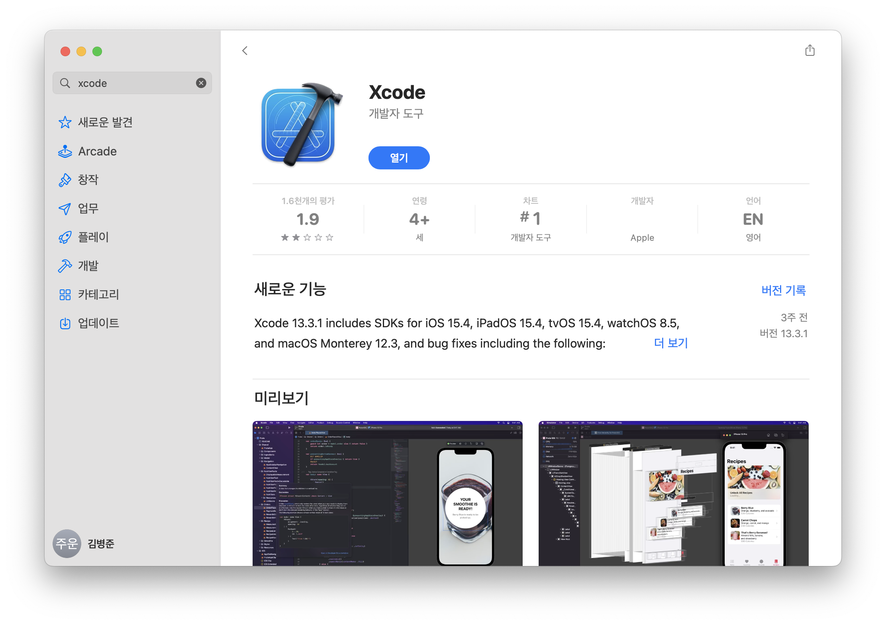
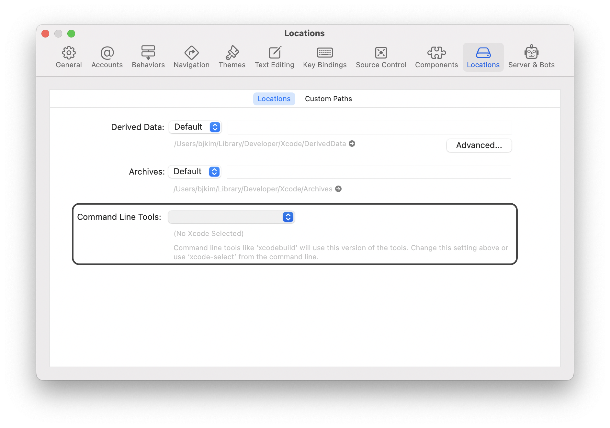
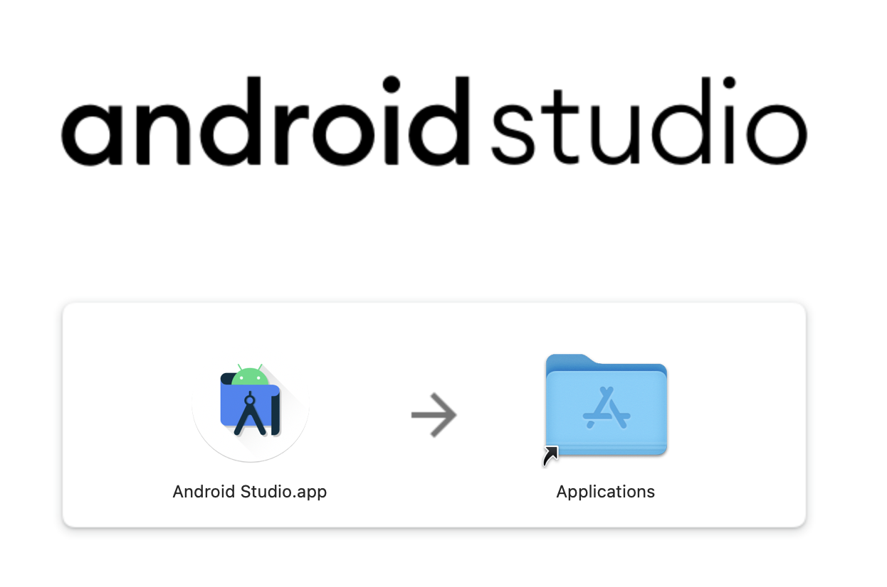
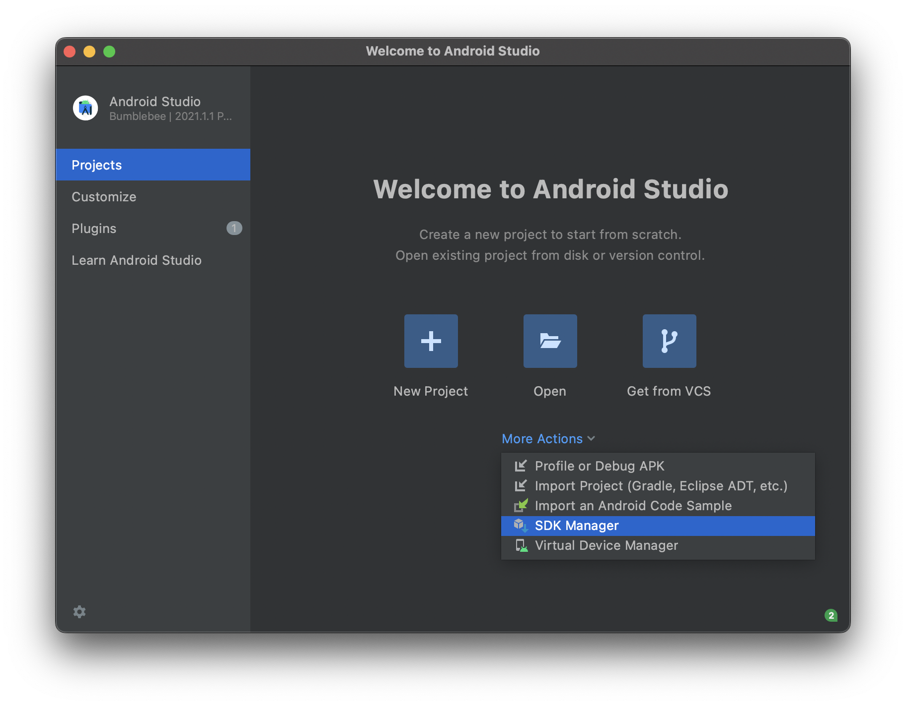
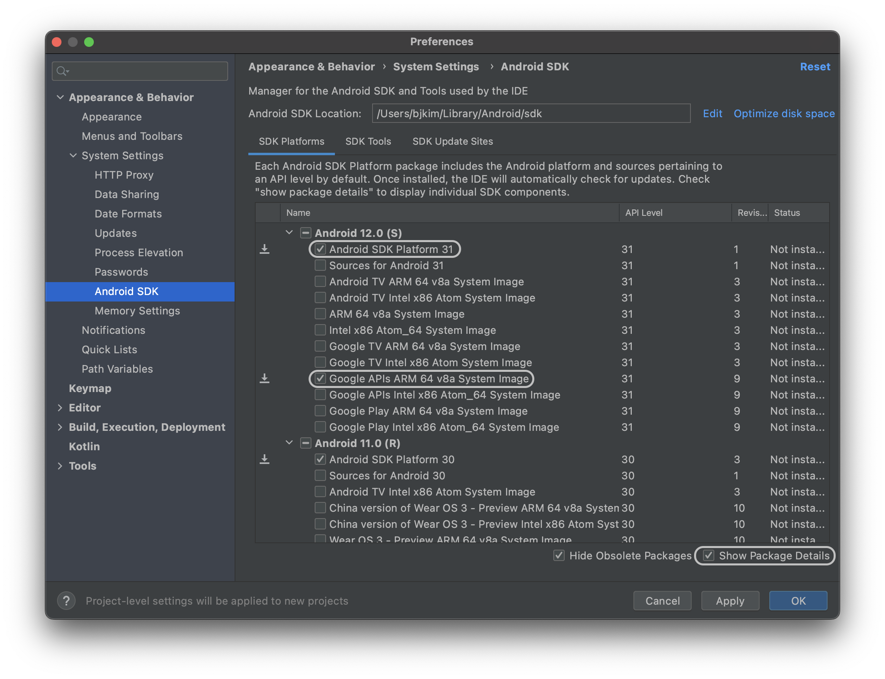
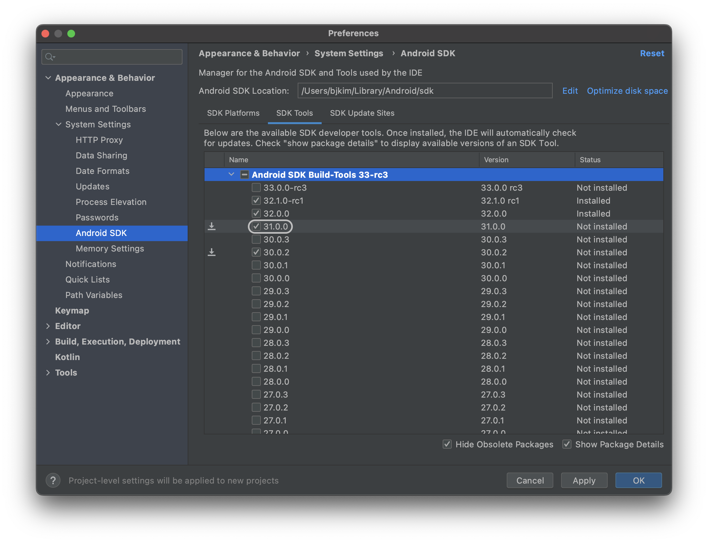

# React Native 설치 및 초기 설정

# 🌏 공통 사항

> [**Homebrew**](https://brew.sh/index_ko) 및 [Node(14 이상)](https://www.notion.so/Node-ebf3a337250c49c7a8319c3386a8de2f?pvs=21) 설치 필수

## ▪️Watchman

- 특정 폴더나 파일을 감시하다가 변화가 생기면, 특정 동작을 실행하도록 설정하는 역할
- RN에서는 소스코드의 추가, 변경이 발생하면 다시 빌드하기 위해 사용

### **Watchman 설치**

```bash
# Watchman 설치
$ brew install watchman

# Watchman 버전 확인
$ watchman --version
2022.03.21.00
```

## ▪️**React Native CLI**

- React Native에는 명령줄 인터페이스가 내장되어 있으므로,  `npx react-native <command>`명령이 실행될 때 CLI의 현재 안정 버전이 다운로드되어 실행
- 이전에 글로벌 react-native-cli패키지를 설치한 경우 예기치 않은 문제가 발생할 수 있으므로 제거

---

# **** iOS

## ▪️Xcode

- App store에서 Xcode를 설치
- Xcode를 설치하면 iOS 시뮬레이터와 iOS 앱을 빌드하는 데 필요한 모든 도구도 설치됨
- 설치시간 1시간 내외 소요됨
  

### Command Line Tools

- Xcode를 연 다음 `⌘` + `,` > Locations > Command Line Tools: [최신 버전 선택]
  

### iOS 시뮬레이터 설치 (필수 X)

- Xcode를 연 다음 `⌘` + `,` > Components > [필요한 시뮬레이터 설치]
- 추후 시뮬레이터 선택 빌드 시 자동으로 설치되므로, 필수 X

## ▪️CocoaPods

- iOS 개발에 사용되는 의존성 관리자

### CocoaPods 설치

```bash
# CocoaPods 설치
$ sudo gem install cocoapods

# CocoaPods 버전 확인
$ pod --version
1.11.3
```

<aside>
🚨 Mac M1 아키텍처는 Cocoapods와 직접 호환되지 않습니다. pod을 설치할 때 문제가 발생하면 다음을 실행하여 해결할 수 있습니다.

- `sudo arch -x86_64 gem install ffi`
- `arch -x86_64 pod install`
</aside>

---

# 🤖 Android

## **Java Development Kit**

- [Homebrew](http://brew.sh/)를 사용하여 Azul **Zulu** 라는 OpenJDK 배포판을 설치하는 것이 최적
- Zulu OpenJDK 배포판은 **Intel 및 M1 Mac** 용 JDK를 제공
- Intel 기반 JDK를 사용하는 것에 비해 M1 Mac에서 빌드가 더 빨라짐

```bash
# zulu11 설치
$ brew tap homebrew/cask-versions
$ brew install --cask zulu11

# java 버전 확인
$ java -version
openjdk version "11.0.15" 2022-04-19 LTS
OpenJDK Runtime Environment Zulu11.56+19-CA (build 11.0.15+10-LTS)
OpenJDK 64-Bit Server VM Zulu11.56+19-CA (build 11.0.15+10-LTS, mixed mode)
```

## Android Studio

### Android Studio 설치

- Android Studio를 [공식 홈페이지](https://developer.android.com/studio)에서 설치
- Download Android Studio > Mac with Apple chip (M1 전용)
  

### 안드로이드 SDK 설치

- `npx react-native init [project_name]` 했을때 `[project_name]/android/build.gradle`의 `buildscript`를 보고 필요한 것들을 설치

```bash
buildscript {
    ext {
        buildToolsVersion = "31.0.0" # 설치해야되는 Tool
        minSdkVersion = 21
        compileSdkVersion = 31
        targetSdkVersion = 31  # 설치해야되는 SDK
        ....
    }
   ....
}
```

- 첫 화면 > More Actions > SDK Manager
- SDK Platforms: [Android SDK Platform 31, Google APIs ARM 64 v8a System Image]
- SDK Tools: Android SDK Build-Tools...: [31.0.0]
  
  
  
- `~/.zshrc` 하단에 환경변수 설정

```bash
export ANDROID_SDK_ROOT=$HOME/Library/Android/sdk
export PATH=$PATH:$ANDROID_SDK_ROOT/emulator
export PATH=$PATH:$ANDROID_SDK_ROOT/platform-tools
```

```bash
# adb 동작확인
$ adb version
Android Debug Bridge version 1.0.41
Version 33.0.1-8253317
Installed as /Users/bjkim/Library/Android/sdk/platform-tools/adb
```
